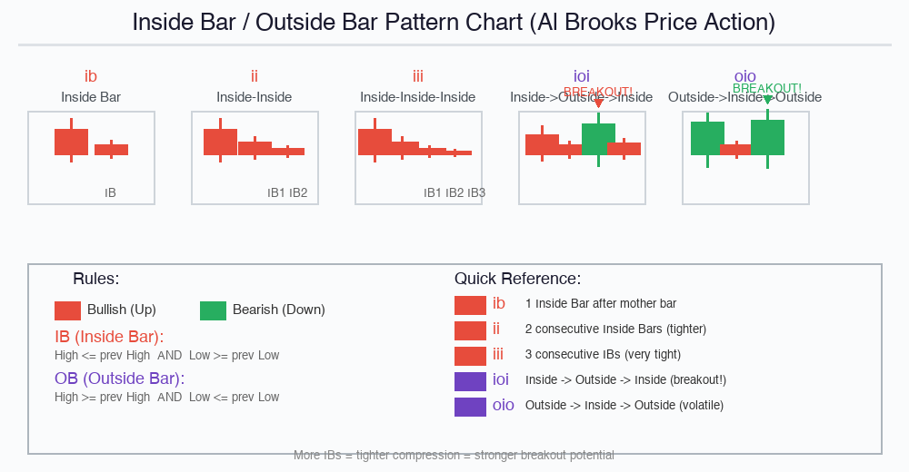
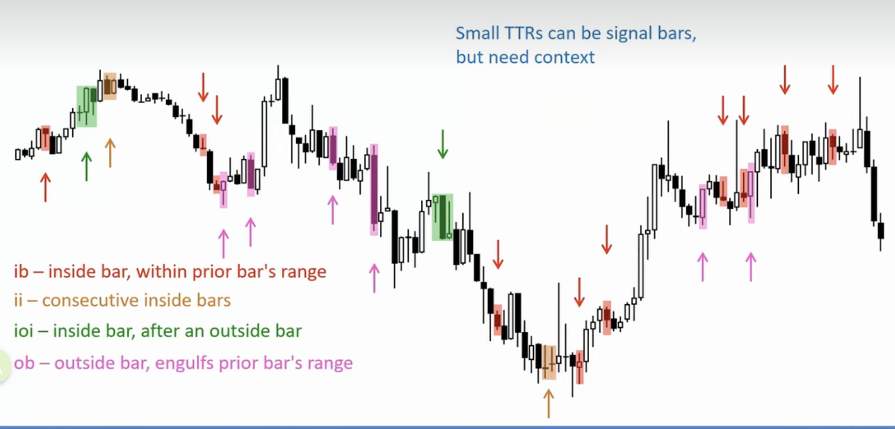

# 交易入门

交易没有百分之百的胜率，重点在于管理概率和赔率。

# 好信号柱的特征


# K线形态：Inside Bar / Outside Bar 与信号柱

> 📺 来源：Al Brooks Price Action 基础课 第18集（08C K线、交易设置与信号柱）
> 📖 课程全集：[B站 - 阿尔布鲁克斯价格行为基础](https://www.bilibili.com/video/BV1bc6tBoE6i)
> 🎯 本集核心：IB/OB 五种形态定义 + 信号柱（Signal Bar）+ 交易设置（Setup）+ 上下文（Context）

---

## 一、五种核心 K 线形态

### 1. ib（Inside Bar）— 单根内包
- **英文原义**：bar that is "inside" prior bar
- **中文**：K线完全内包于前一根K线
- **判定规则**：
 - 当前K线的 **高点 ≤ 前一根高点**
 - 当前K线的 **低点 ≥ 前一根低点**
- **市场含义**：多空双方都在犹豫，市场在收缩蓄能。前一根大K线叫「母线」（Mother Bar），内包的小K线在其内部震荡

### 2. ii（Inside-Inside）— 双连内包
- **英文原义**：inside-inside is 2 consecutive bars
- **中文**：连续 2 根内包 K 线
- **特点**：比单根 IB 收缩更紧，犹豫时间更长，后续爆发动能更强

### 3. iii（Inside-Inside-Inside）— 三连内包
- **英文原义**：inside-inside-inside is 3 consecutive bars
- **中文**：连续 3 根或更多内包 K 线
- **特点**：极度压缩，市场几乎静止，是强突破的前兆
- **实战意义**：iii 越多 = 压缩越极致 = 突破后走势越猛烈

### 4. ioi（Inside → Outside → Inside）— 内外包内 ⭐重点
- **英文原义**：inside-outside-inside is 3 consecutive bars
- **中文**：内包 → 外包 → 内包，连续 3 根 K 线
- **结构分解**：
 - 第1根：IB（内包，收缩）
 - 第2根：OB（外包，突破双向）
 - 第3根：IB（重新回到内部）
- **为什么重要**：Al Brooks 最推荐的入场形态之一！先压缩→再突破→再回归=经典突破信号

### 5. oio（Outside → Inside → Outside）— 外内外包
- **英文原义**：outside-inside-outside is 3 consecutive bars
- **中文**：外包 → 内包 → 外包，连续 3 根 K 线
- **结构分解**：
 - 第1根：OB（外包，大幅波动）
 - 第2根：IB（暂时回到内部）
 - 第3根：OB（再次大幅突破）
- **特点**：双向剧烈波动，风险高但机会也大

### 补充：ob（Outside Bar）— 单根外包
- **英文原义**：outside bar, engulfs prior bar's range
- **中文**：外包 K 线，完全吞没前一根 K 线的价格范围
- **判定规则**：
 - 当前K线的 **高点 ≥ 前一根高点**
 - 当前K线的 **低点 ≤ 前一根低点**
- **市场含义**：一方力量突然占优，价格大幅波动。可能是趋势启动，也可能是反转

---

## 二、判定规则速查表

| 形态 | 英文 | 判定条件 | 含义 | 风险等级 |
|------|------|---------|------|---------|
| **ib** | Inside Bar | High≤前高 且 Low≥前低 | 收缩蓄能 | ⭐ 低 |
| **ii** | Inside-Inside | 连续2根IB | 更强蓄能 | ⭐⭐ 中低 |
| **iii** | Inside×3 | 连续3根+IB | 极致压缩 | ⭐⭐ 中 |
| **ioi** | I→O→I | IB→OB→IB | 经典突破信号 | ⭐⭐⭐ 中高 |
| **oio** | O→I→O | OB→IB→OB | 双向剧烈波动 | ⭐⭐⭐⭐ 高 |
| **ob** | Outside Bar | High≥前高 且 Low≤前低 | 大幅突破/吞没 | ⭐⭐⭐ 中高 |

---

## 三、Signal Bar（信号柱）— 本集核心概念 🔑

### 什么是 Signal Bar？
- **英文原义**：Signal Bar — a bar that signals a potential trade entry
- **中文**：信号柱 — 提示可能入场的标志性 K 线

### Signal Bar 的关键特征
1. **必须放在上下文中看**（Context is everything!）
 > "Small TTRs can be signal bars, but need context."
 > 小型交易区间的 K 线可以是信号柱，但需要结合上下文判断

2. **IB/OB 都可以是 Signal Bar**，但不能孤立使用
3. **好信号柱的特征**：🔝有图例
 - 有明确的实体（Body），不是纯影线的十字星
 - 收盘价靠近实体端点（不是中间）
 - 出现在关键位置（支撑/阻力位、趋势回调后）

### 什么时候 IB/OB 是有效信号？
| 场景              | 有效？            | 说明     |
| --------------- | -------------- | ------ |
| 上升趋势 + 回调后出现 ib | ✅ 强买入信号        | 趋势延续   |
| 下降趋势 + 反弹后出现 ib | ✅ 强卖出信号        | 趋势延续   |
| ioi 形态完成后的方向突破  | ✅ Al Brooks 首选 | 先压后爆再回 |
| 横盘区间中间随机出现 ib   | ❌ 弱信号          | 无方向性   |
| oio 在震荡市中出现     | ⚠️ 谨慎          | 可能是假突破 |


---

## 四、Setup（交易设置）— 入场前的准备

### Al Brooks 的交易 Setup 三要素

**最佳交易公式 = 市场状况（Trend/TR）+ 水平位置（Level）+ 价格行为信号（Signal）

1. **市场状况（Market State）**
 - 趋势市（Trend）：上涨/下跌，用 EMA20 判断方向
 - 交易区间（TR, Trading Range）：横盘震荡，高低点明确

2. **水平位置（Level）**
 - 支撑位（Support）/ 阻力位（Resistance）
 - 前高前低、整数关口、斐波那契回撤位
 - EMA20 动态支撑/阻力

3. **价格行为信号（Signal）**
 - ib / ii / ioi / oio / ob 等 K 线形态
 - Pin Bar（针形线/锤子线）
 - Engulfing Bar（吞没线）

### 实战入场流程
```

第1步：判断市场状态 → 趋势还是区间？  
第2步：找到关键水平位置 → 支撑/阻力在哪？  
第3步：等待 Signal Bar 出现 → ib/ioi/ob？  
第4步：确认 Context → 信号位置对吗？  
第5步：入场 → 设止损止盈

```

---

## 五、Context（上下文）— 最重要的一句话

> **"Always trade in the context of what came before."**
> （始终在前序行情的上下文中交易。）

### Context 包含什么？
| 因素 | 如何影响信号 |
|------|-------------|
| **当前趋势方向** | 顺势信号强，逆势信号弱 |
| **前面几根 K 线的走势** | 是加速还是减速？ |
| **所在位置** | 区间中部 vs 区间边缘 vs 突破位 |
| **时间周期** | 大周期方向决定小周期信号有效性 |
| **市场状态** | 趋势市 vs 交易区间（TR）|

### TR（Trading Range）交易区间的特殊规则
- TR 中 **80% 的突破会失败**（假突破）
- TR 中适合 **低买高卖（BLSH: Buy Low Sell High）**
- TR 中的小 IB/OB 要特别谨慎，容易是噪音
- 只有在 TR 边缘出现的 ioi 才值得重点关注

---

## 六、中英术语对照表

| 英文 | 中文 | 说明 |
|------|------|------|
| **Inside Bar (IB)** | 内包 K 线 | 完全在前一根范围内 |
| **Outside Bar (OB)** | 外包 K 线 | 完全吞没前一根范围 |
| **Mother Bar** | 母线 | IB 所参照的前一根大范围 K 线 |
| **Prior Bar** | 前一根 K 线 | 参照基准 |
| **Consecutive** | 连续的 | 接连出现的（ii/iii） |
| **Engulfs / Engulf** | 吞没、包裹 | OB 的特征动作 |
| **Signal Bar** | 信号柱 | 提示入场的标志性 K 线 |
| **Setup** | 交易设置 | 入场前的三要素组合 |
| **Context** | 上下文 | 整体行情背景环境 |
| **TTR (Trading Range)** | 小型交易区间 | 短期横盘震荡区域 |
| **TR (Trading Range)** | 交易区间 | 更大的横盘震荡区域 |
| **Trend Bar** | 趋势 K 线 | 有明确实体的方向性 K 线 |
| **Doji** | 十字星 | 开收价几乎相等，表示平衡 |
| **Wick / Tail / Shadow** | 影线/针脚 | K 线实体外的上下引线 |
| **Body** | 实体 | 开盘价到收盘价的部分 |
| **Follow-Through** | 跟随确认 | 信号柱之后确认方向的下一根 K 线 |
| **Breakout (BO)** | 突破 | 价格突破关键水平位 |
| **Failed Breakout** | 失败突破 / 假突破 | 突破后迅速回落 |
| **Pullback** | 回调 | 趋势中的反向运动 |
| **Reversal** | 反转 | 趋势方向改变 |
| **High 1 / High 2** | 高点1/高点2 | Brooks K 线计数法，识别回调结构 |
| **Low 1 / Low 2** | 低点1/低点2 | Brooks K 线计数法，识别回调结构 |
| **EMA 20** | 20周期指数移动平均 | Brooks 主要（通常唯一）使用的指标 |
| **Price Action** | 价格行为分析 | 纯 K 线形态做决策，不依赖指标 |
| **Bar-by-Bar Analysis** | 逐 K 线分析 | Brooks 的核心分析方法 |

---

## 七、实战要点总结（本集金句）

1. ✅ **IB 越多 = 压缩越紧 = 突破动能越大**（弹簧原理）
2. ✅ **ioi 是最经典的突破入场信号**（先收→再放→再收→然后选方向）
3. ✅ **oio 表示双向大幅波动，需谨慎管理仓位**
4. ✅ **永远不要孤立看单一形态，Context 决定一切**
5. ✅ **Small TTRs can be signal bars, but need context**（小型区间的 K 线可以是信号，但要结合背景）
6. ✅ **最好的价格行为交易 = 市场状况(Trend) + 水平位置(Level) + 信号(Signal)**
7. ✅ **TR 中 80% 突破会失败**，不要盲目追突破
8. ✅ **Signal Bar 必须有 Follow-Through（跟随确认）才入场**

---
