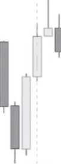
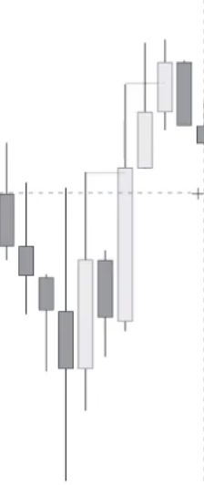
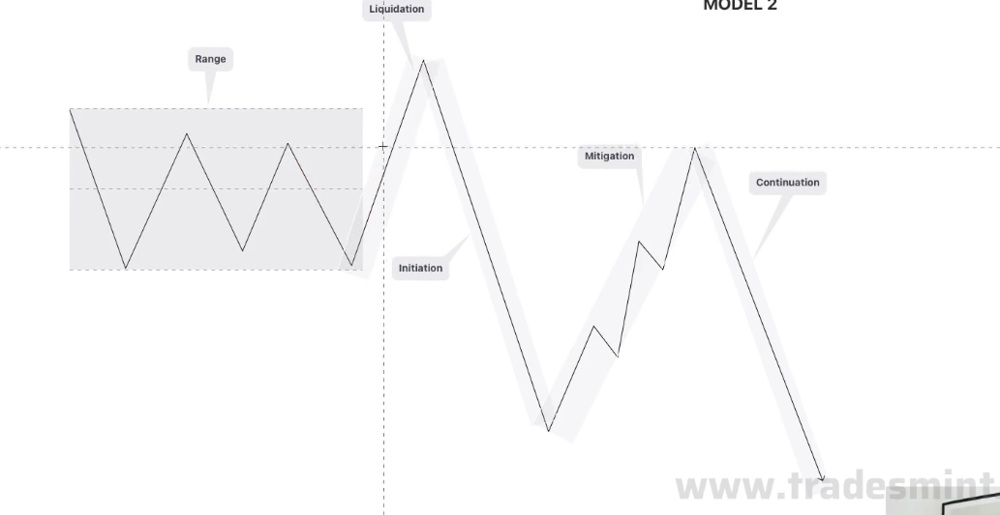

 
1：BOS 和CH必须实体且有1根K跟随、反之就是危险和反转
2：必须3根 阴/阳线 算是 高/低点 就是C的位置

## 不合格的上涨K 不算新低

**必须是连续的**
**上涨必须2根上影线碰到实体才是有效的新的低点、反之一样**

## 合格的上涨K的新低点

**上涨必须上影线碰到实体才是有效的新的低点、反之一样**

3：必须等K线结束有反弹才能进场

C之后要有回踩在入场、小仓位就正常打

