目标4000美金/月、一周1000、 每周1nq 50点 or  5mnq100点（一周2笔 50点）

# 入场list

- 什么时间级别的MSS有效：等5m或者15m的MSS在1m找机会入场（会错失机会和高盈亏比）
# 953

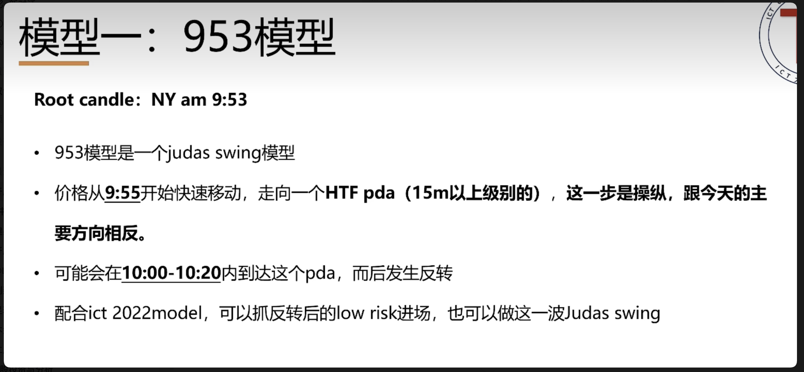

1. **9.55左右 进入HTF PDA 操纵**
2. **发生SMT**
3. **1min的iFVG收盘收在外面**
4. **止盈就stdv的-2.5或者-2之间或。。。**

# 1034

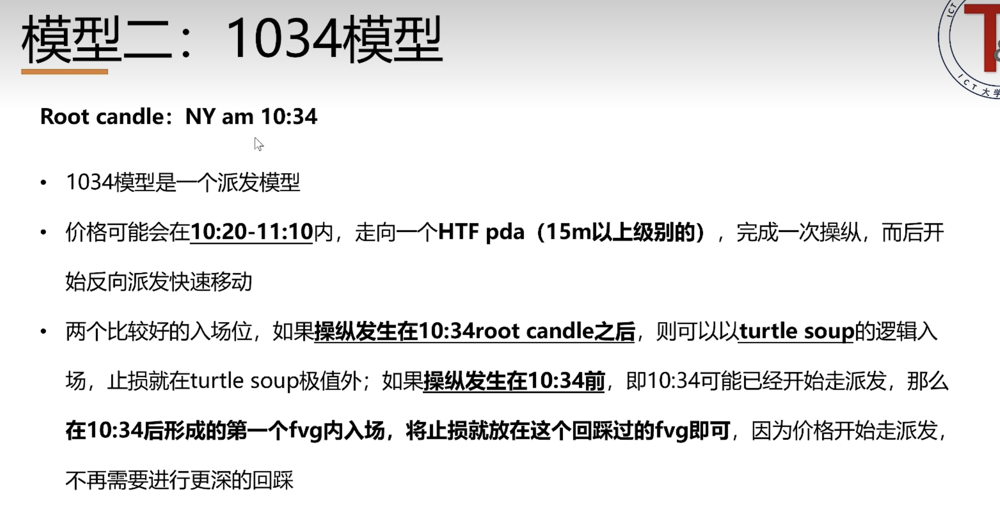

1. 10.20-11.10之间 走进一个HTF PDA 操纵
2. 一：操纵在10.34之后 以海龟汤入场  二：操纵发生在10.34之前 形成的第一个fvg入场

# 1110

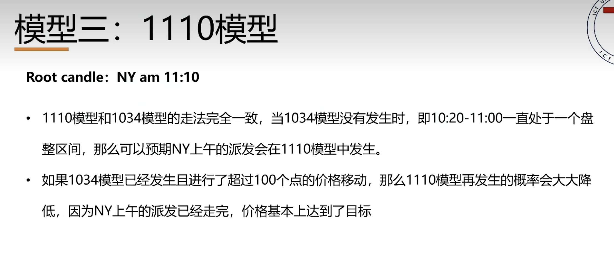
 **同1034模型**

# 注意⚠️

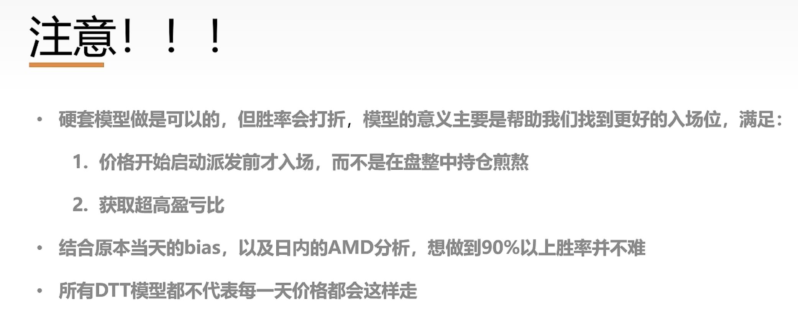

## 纽约上午所有模型

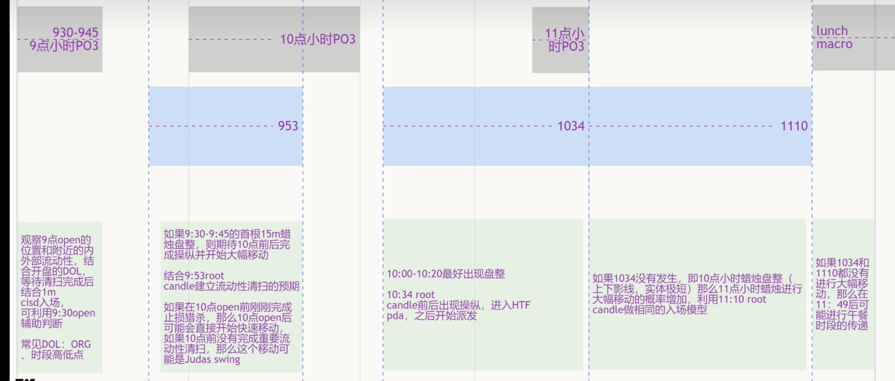

# 伦敦反转

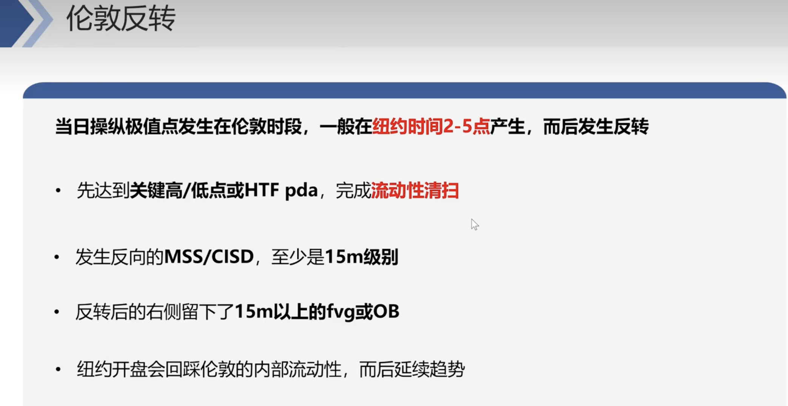

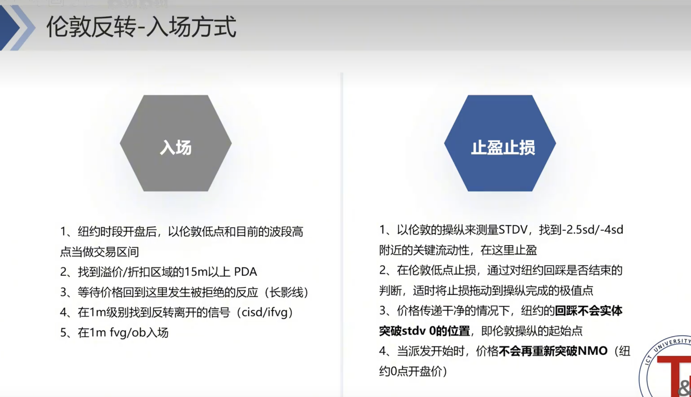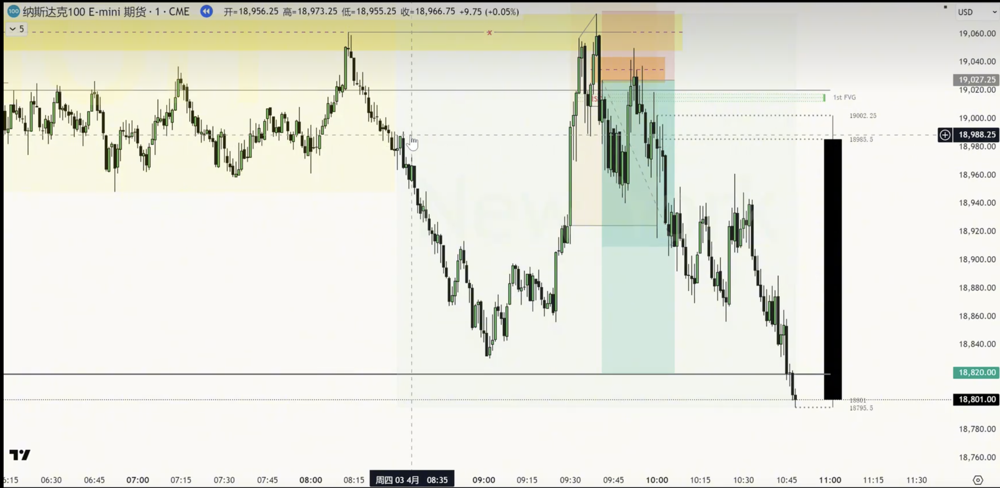

# 纽约反转

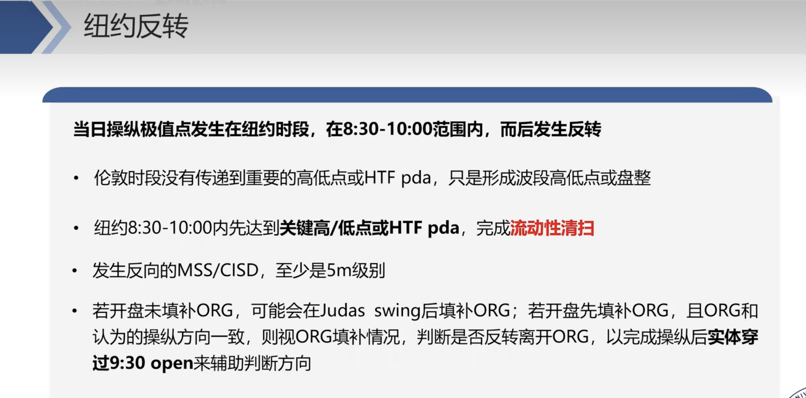

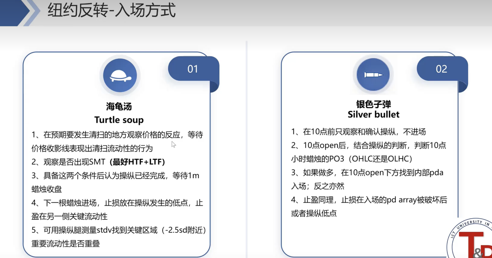

# 单边扩张

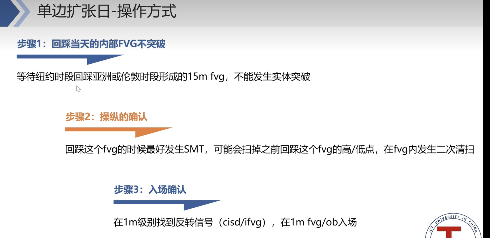

# 晚安北京

## 延续

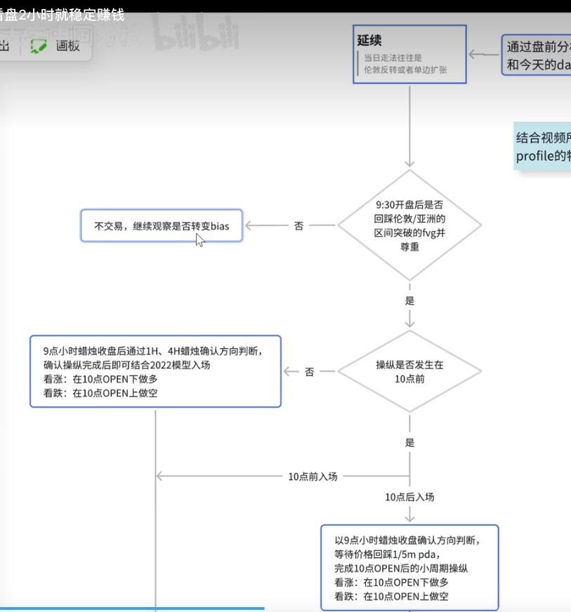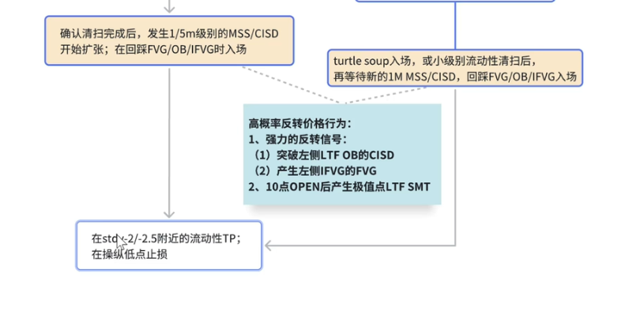

## 反转

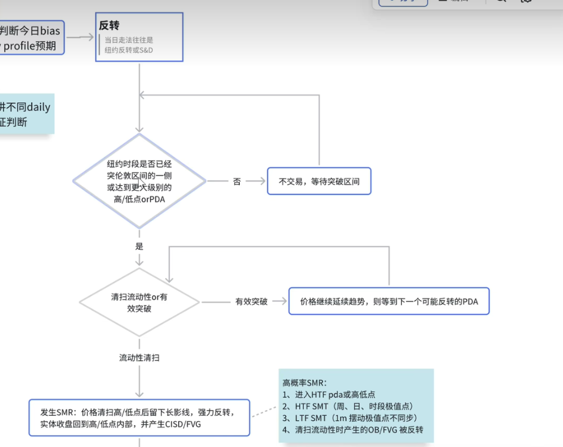
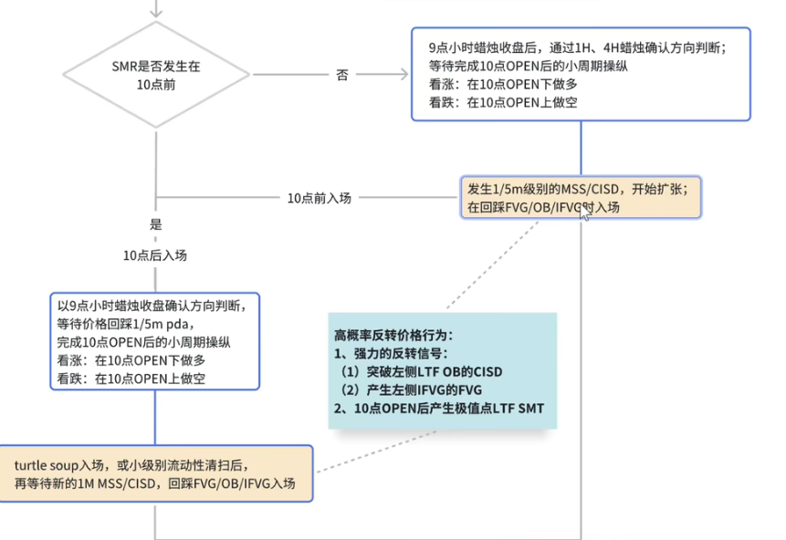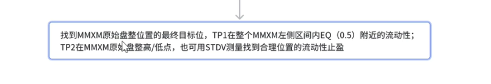