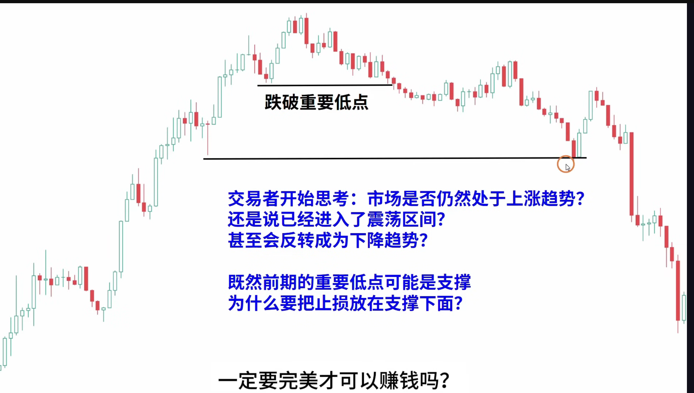
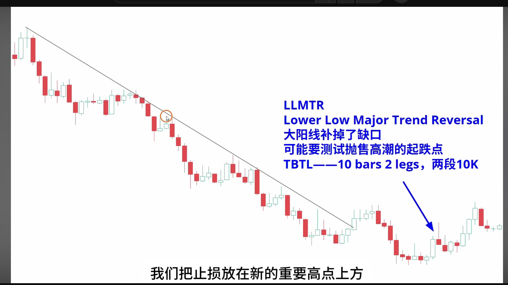
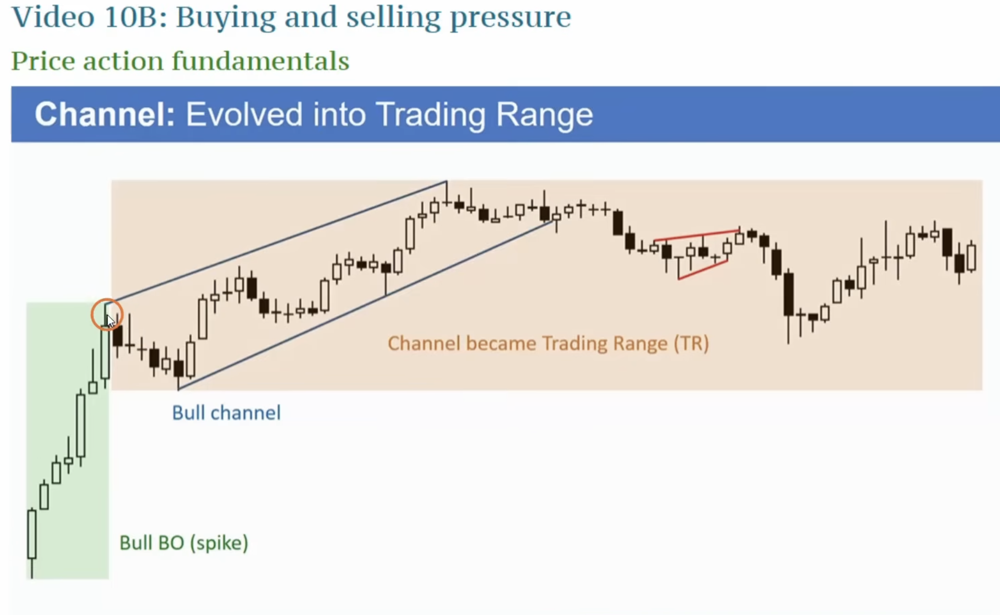
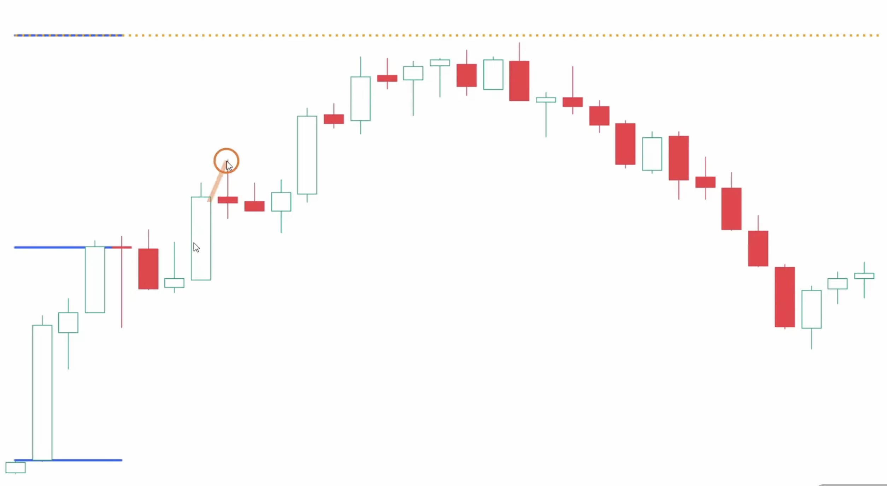
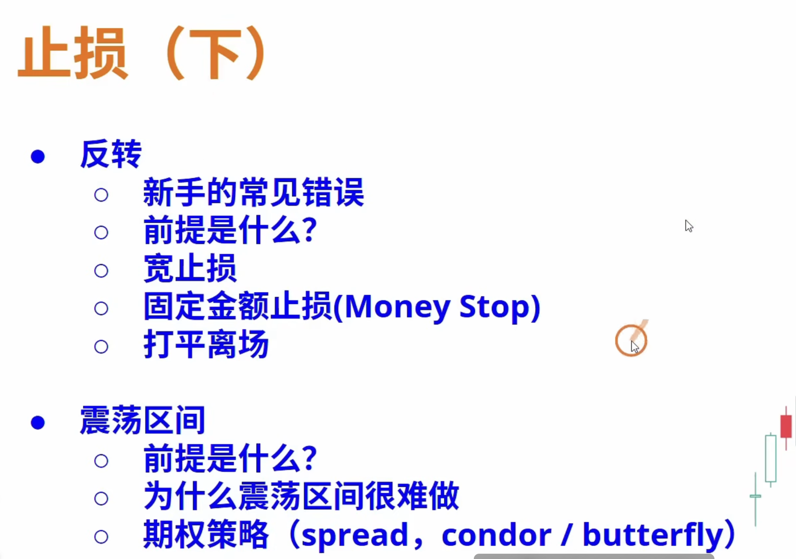

# 止损

目标位 or 提前止盈

依赖初始止损 or 提前离场

窄止损 or 宽止损

争取打平 or 小亏离场 

当低点不断抬高，高点不断抬高这是个波段行情，概率站在多头这一方，
空头的离场，多头的买入，断推动行情继续上涨，当重要的地点被跌破。
市场开始困惑，会怀疑上涨趋势是否还成立，多头开始止盈，开始scalp交易赚快钱，形成震荡区间，概率逐渐55开，
直到某一方强势突破，形成反转。跌破重要低点出现的反弹可能是由于**大量计算机将前期低点作为scalp交易的止盈点止盈造成的**，并不能作为做多信号，因为背景不好，应该逢高顺势做空胜率更高

# 宽通道

**宽通道75%会被反向突破去test起点**

# 窄通道

**窄通道**第一次反转的尝试**80%会失败**：**多头/空头**要等**第二入场点**/**离场点**、通常是**小双底/双顶**的形态。

# TBTL

TBTL = Ten Bars, Two Legs（10根K线，2段回调）

Al Brooks 的经验法则，说的是回调/调整通常持续约10根K线，分2段完成。

# 通道转变

上升/下降**通道** 一但**回调**、趋势就会不在了、会变成**通道趋势** 然后再变成**震荡区间**

**通道的转变可能不明显**

