市场的底层逻辑就是：**流动性（Liquidity）**

# 交易员 6 大核心能力清单（1‑10 分自我打分）

1. **信息筛选**：能否过滤噪音，只关注有效信息
2. **框架思维**：是否拥有固定分析流程，逻辑严密
3. **双向预案**：能否同时持有相反观点，灵活切换
4. **纪律性**：克制冲动，不执行计划外交易
5. **信号信心**：连续亏损后，依旧敢于执行系统信号
6. **持仓耐心**：抵御 FOMO、处置效应，严格按计划持仓

##  复盘流程 

- 流水线流程：固定清单 → 盘前计划（当前处于什么阶段） → 标准入场
- 效率指标：合规单数 / 总单数 ≥90%
- 两大心理敌人：空仓防 FOMO，持仓防处置效应

# IPDA

IPDA（Interbank Price Delivery Algorithm，银行间价格传递算法）

1. **积累 Accumulation** 小区间密集盘整，聪明钱积累仓位。
2. **冲击 Expansion** 价格朝某一方向快速持续扩张。
3. **回调 Retracement** 反方向回补内部流动性。
4. **反转 / 延续 Reversal/Continuation** 回调结束后，价格改变原有趋势，或是延续原有趋势。

> 核心观点：任意时刻的市场价格行为，都可以归类到以上四个阶段中的某一类。

# ICT 框架

ICT 全部知识划分为 3 大类：

## 零件（PD Array，PD 阵列）

模型的基础构件，如同拼装零件。 示例：FVG 公平价值缺口、OB 订单块、流动性等基础概念。

## 图纸（Blueprints）

人为设定的规则框架，规定如何把零件组装在一起。 示例：交易区间绘制方法、MSS 市场结构突破判断。

> 图纸不完全来自 K 线本身，是交易员按照标准人为定义。

## 模型（Models）

零件 + 图纸组合后，市场反复出现的价格行为模板。 示例：2022 模型

### 学习路径

> 记住零件、图纸定义 → 模拟盘结合时间 + 价格训练 → 搭建专属交易系统 → 持续迭代优化

# FVG&IFVG⭐

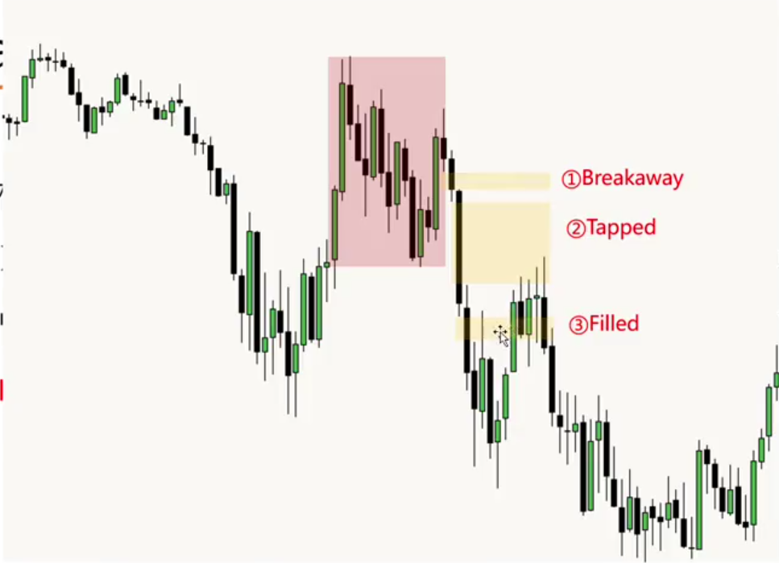

**在第二个的FVG挂单进场**🔝

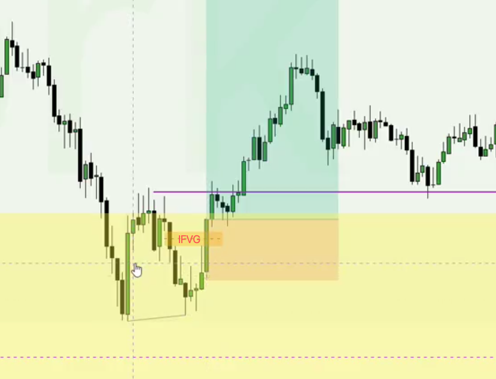

**一小时级别的流动性清扫、然后1m 看ifvg 进场** 🔝

**iFVG：原 FVG 被实体反向突破后，从支撑/阻力变成反向的阻力/支撑**。🔝
## FVG的方向的四种类型

|类型|K 线构成|含义|强度|
|---|---|---|---|
|AAA|三根连续同向 K 线|强力传递，可能形成 Breakaway Gap，短期不容易回踩|**最强**|
|BAA|第 1 根反向，后两根同向|反转初期。第一根 B 生成 OB 订单块，同时扫流动性。价格大概率深回踩 OB；**OB 是否被跌破，比 FVG 是否被跌破更关键**|强|
|AAB|前两根同向，第三根反向|趋势传递临近末端。第三根 B 扫取买方流动性（扫高点）。很大概率回踩进入 FVG，整体强度偏弱|弱|
|BAB|第 1 根反向，第 2 根同向，第 3 根反向|结构最复杂。  长实体 B → FVG 失效，价格在区间震荡反复穿插；  短实体（影线）B → 影线构成推进块，行情有望延续原有方向|取决于 B 实体长度|
- AAA：最强，少回踩
- BAA：强，重点看 OB
- AAB：弱，大概率回踩 FVG
- BAB：不定，看 B 的实体长短 

# SMT⭐

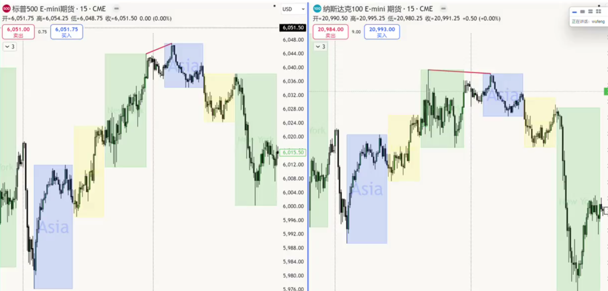
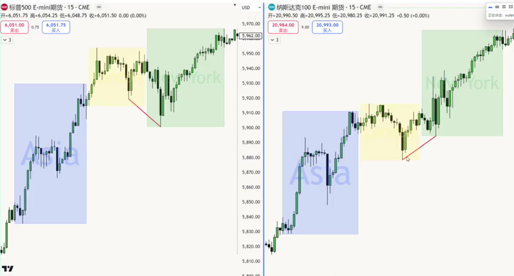

# ⭐小周期反转判断：MSS 狭义、CSD、iFVG

> 三者均为**小周期反转判断工具，配合 2022 model 使用**，不需要等待大周期结构完全成型再进场。

## MSS（狭义）

小周期内，实体强力突破两个波段点中间的反向点位。
mss反转必须是突破实体且有跟随K才算mss、反之则是流动性清扫

## CSD（Change in State of Delivery，传递方向转变）

⭐核心入场判断工具

> **两个前置条件，必须同时满足，缺一不可**

1. **流动性清扫（优先级最高，高于所有 PD Array 位置）** 没有流动性清扫，直接判定为盘整。 优先选用小时及以上级别清扫：扫小时 FVG、4H / 日线高低点、小时级别 SMT。
2. **连续同向实体收盘**（4根） 生成 CSD 的这一段行情，每一根 K 线必须同向实体收盘，**不允许出现任意一根反向实体收盘 K 线**。

✅CSD 生效标志：实体强力突破最后一段趋势的开盘价。 CSD 确认后可以直接入场；最终入场方案由盈亏比、止损规则决定。

## iFVG（Inverse FVG，反向公平价值缺口）

实体直接击穿反向 FVG；全程不允许出现反向实体收盘 K 线。

- 强力实体突破：可直接入场
- 弱突破（带影线回踩）：不直接开仓，等待回踩机会

### 入场 & 止损参考

1. 强力 iFVG 直接进场

- 做多：止损放在生成 FVG 那根 K 线低点
- 做空：止损放在生成 FVG 那根 K 线高点

2. 行情存在推进块 OB（订单块） 止损下移至推进块 OB 下方，不用放在 FVG 蜡烛高低点。

# 2022模型⭐

## 反转三要素

1. **清扫流动性**：扫掉一侧流动性，影线突破即算作清扫
    - 看涨反转：扫买方流动性（Buy Stops）
    - 看跌反转：扫卖方流动性（Sell Stops）
2. **MSS**：小周期结构反转，实体收盘突破前一段趋势最后一段的起涨 / 起跌点。
3. **回踩入场**：趋势信号确认之后，等待价格回踩 PD Array 再进场。

## ⭐核心难题：扫哪一处流动性才会真正反转

图表每一处高低点都属于流动性； 判定标准：**更大周期流动性 + 当前周期反转信号，两者结合**。

### 四类交易级别（以日线为基准划分）

1. **日线级别反转** 趋势整体多空切换。

> 必要条件：必须扫日线 / 周线级别的高低点。

2. **日线级别延续** 日线大趋势保持不变；价格回调至 4H 内部 PD Array 之后继续原有趋势。
3. **日内反转（伦敦 / 纽约反转）** 仅仅是当日内部行情反转。

> 观察：日线溢价 / 折扣区对应的 1H PD Array，或是日线高低点。

4. **日内延续** 当日的最高点 / 最低点已经产生；后续只看 1H、15min 内部流动性，不再参考日线级别流动性。

# MMXM

## 标准完整流程

1. 原始盘整区
2. 第一次扩张（向上拉高，收割买方流动性：打爆空头止损、引诱多头追高）
3. 第一次再积累（生成 OB 订单块）
4. 第二次扩张
5. 第二次再积累（生成 OB 订单块）
6. 价格进入大周期 PD Array 区域
7. SMR 聪明钱反转区：机构完成全部反向建仓
8. MSS 市场结构反转确认
9. 第一段回踩：**不允许跌破左侧 Breaker 突破块**
10. 第二段回踩：**不允许跌破新生成 Breaker 突破块**
11. 行情最终回落至原始盘整低点

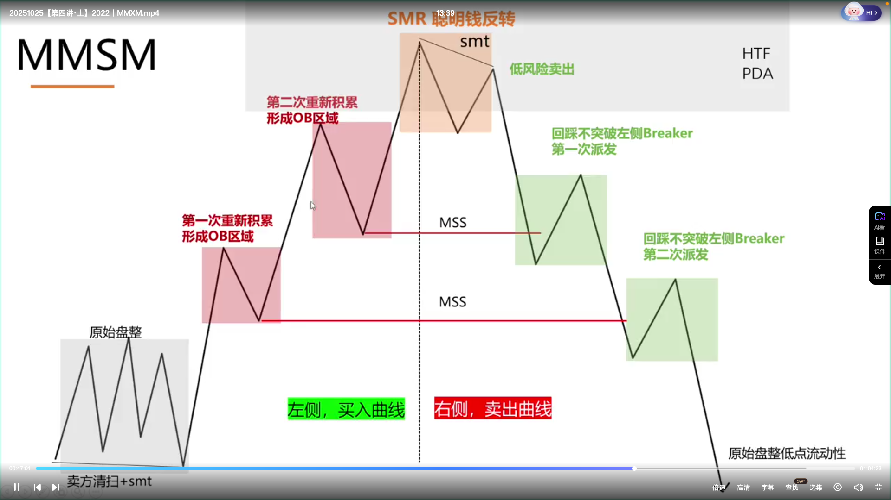

## ⭐对称性核心规则

> 速度对称：左快 → 右快，左慢 → 右慢

- 左侧快速派发拉出 FVG，右侧对应位置同样快速上涨拉出 FVG
- 左侧为盘整震荡，右侧对应位置同样走盘整震荡

结构映射关系

- 左侧 OB（订单块） → 右侧 Breaker（突破块）
- 左侧 FVG → 右侧 FVG 或者 BPR

## SMR 反转之后的二次清扫机会

SMR 确认反转后的右侧行情，两类低风险机会：

1. FVG 区间内部发生二次流动性清扫
2. SMT 不同步（例：ES 扫掉低点，NQ 并未扫掉低点）

# PO3 蜡烛大类

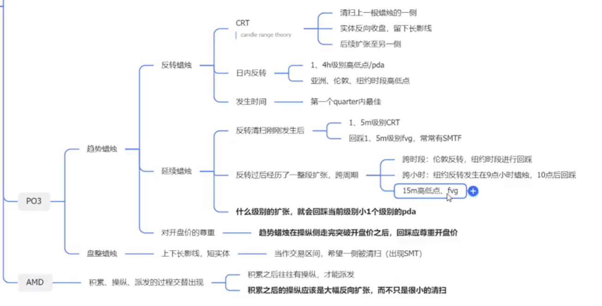

PO3 分为：**趋势蜡烛**、**盘整蜡烛**
**趋势蜡烛**再细分：**反转蜡烛**、**延续蜡烛**

## ⭐反转蜡烛 CRT（Candle Range Theory 蜡烛区间理论）

作用：清扫前置流动性之后完成反转。

### CRT 三个必要条件（全部满足）

1. 清扫前一根蜡烛一侧流动性（高点 / 低点），留下长影线
2. **实体反向收盘**：实体方向与前一根 K 线相反；看涨反转，实体不能收得比前一根更低
3. 行情后续扩张至被清扫蜡烛的另外一侧，反转正式完成

### CRT 反转观察位置

1. 1H / 4H 高低点
2. 1H / 4H FVG、OB
3. 交易时段 Session 高低点：亚洲、伦敦、纽约时段高低点

### 最佳操纵时间窗口（Quarter C）

操纵发生在 K 线**第一个 Quarter (C) 效果最优**

- 1H 蜡烛：1 个 C = 15 分钟
- 4H 蜡烛：1 个 C = 1 小时

时序结构：第 1 个 C 发生操纵；后续至少 2 个 C 走扩张；最后 1 个 C 走回撤。

### CRT 入场方式

1. 清扫流动性之后，等待 **MSS 结构移位确认** 再进场。

> 流动性经常二次清扫；第一次扫完收回，第二次清扫并且突破前极值，反转信号才明确。

2. 价格触碰关键流动性，小周期瞬间出现 SMT，可直接入场。

> SMT 出现代表不应该继续更深突破。

> ⚠️重要约束：反转有效性必须对齐大周期流动性预期。 若大周期本就要打出更深高 / 低点（例如周线 SMT 已经出现），就算出现 CRT 全套条件，也不可以逆大周期做反转。

## ⭐PO3 延续蜡烛

定义：回撤至 FVG / OB 之后，继续原有趋势方向的 K 线。 依据反转之后时间跨度，选用对应周期找入场：

1. **反转刚发生，未跨 1H** 看 1min /5min CRT；反转清扫完成后，几乎一定会出现 1/5min CRT 入场机会。

> 讲师偏好入场：回踩 **SMTF（SMT + FVG 重叠）**。

2. **已经走完一整段扩张、跨 1H 周期** 直接看 15min 高低点、FVG。

> 扩张走完后 5min 会大量噪音 FVG，大多和 15min 重合，用 15min 做过滤。

3. **跨时段场景（例：伦敦反转，纽约回撤）** 只看 15min 级别 FVG；1min、5min 参考价值很低。

## PD Array 绘制原则

1. 不要把全部周期 PD Array 都画满；同一时间只有一个最高概率行情预期。
2. 先用 MMXM 判定大方向；顺着行情方向标记关键流动性位置，逐级推演。
3. PD Array 被价格击穿，但没有触发强力反转，行情就会走向下一组 PD Array。
4. 只需要标记当下最有可能抵达的位置；无法一开始就锁定最终止盈。

> 实操认知：入场、止损由自己掌控；行情到达时间、是否到达、盈利空间由市场决定。

# 方向判断

## 1、Daily Bias 与 Daily Profile 核心区别

|项目|Daily Bias（日内偏向）|Daily Profile（当日剧本/框架）|
|---|---|---|
|内容|只给**方向倾向**：今天整体最终偏向更高 还是 更低|完整日内剧本：先去哪、在哪反转、再去哪、纽约时段该发生什么，完整时序路径|
|作用|知道大方向，但不知道过程、反转时间点|完整交易计划的基础，入场、止损、目标全部依托它|
|交易价值|仅靠 Bias 容易反复被扫损|判断对 Profile，行情流畅、少扫损，利润空间大；准确率依赖大周期清晰+亚盘、伦敦盘信号清晰|

> 重点：交易计划**基于 Daily Profile，不是只靠 Daily Bias**。可以不使用Profile，只靠关键清扫位交易，但错的时候会连续被扫止损。

> 时区说明（指数期货：美东时间）

- 亚洲：前一日20:00‑当日03:00｜2:00‑3:00 亚‑伦衔接
- 伦敦：03:00‑08:30
- 纽约：08:30‑16:00
    
    > 外汇整体会提前大约1小时。
    

## 2、4种 Daily Profile 类型

### ① London Reversal 伦敦反转

> 日线极致高低点诞生在伦敦时段（2:00‑5:00）；极点一个在亚洲、一个在伦敦，出现SMT跨品种高低点分歧，同样归为本类。

✅识别条件

1. 伦敦极点必须触碰：重要高低点 / PD Array(PDR) / 小时FVG / 拒绝块 / OB订单块；无这些结构，不算有效反转极点
2. 伦敦时段出现 **MSS市场结构转变 或 CSD交付状态改变**（实体突破伦敦末段走势）
3. 反转右侧留下15min/1h级别 **FVG公允价值缺口**，作为回踩入场区；经常和NMO纽约午夜开盘价重叠
4. 纽约开盘前半小时大概率回踩这个FVG

❌排除条件

- 伦敦扩张立刻被回踩填平、没有CSD → 盘整，不是伦敦反转
- 伦敦极点无关键结构，无CSD → 不是伦敦反转

入场：FVG + NMO叠加位置等待小级别确认。

---

### ② New York Reversal 纽约反转

> 极致高低点出现在纽约时段，集中 8:30‑11:00 两个子类 1）开盘即反转（9:00‑10:00）

- 前提：伦敦只是盘整波段，**没有产生重要大级别高低点/PDR**
- 走势：一段完整上涨/下跌创出新高/新低，出现SMT分歧，快速回撤至整段行情0.5位置
- 反转点要有大周期PD Array /流动性池；用1分钟CSD做入场确认

2）延后确认型

- 等待5分钟 MSS / CSD，回踩之后抓第二段趋势

辅助确认信号

- 9:30开盘：先假动作，随后实体击穿9:30开盘价，确认纽约反转
- 第一个FVG被实体反向突破
- ORG开盘区间缺口：
    - 有大ORG：填补ORG过程中 / ORG内部上三分位/中线发生反转入场
    - 没有填补ORG：行情目标就是去填补ORG

目标位：ORG、日线/4H高低点、MMM做市商模型给出的流动性目标DOL。

> 注意：做纽约反转，**需要小时级别清扫已经发生**，不能只用小周期。

---

### ③ One‑sided Expansion 单边扩张

> 日内极致点出现在亚洲，全天单向趋势。 成因：大周期派发阶段；前一日充分盘整积累，日内没有操纵，直接走单边。

✅识别规则

1. NMO之后可有SMT（非必需），价格单边运行，不再返回NMO
2. **亚‑伦衔接段2:00‑3:00开始启动扩张，产生至少15min FVG**
3. 亚洲极点不被伦敦扫破；该FVG不被实体反向击穿（影线回踩允许）
4. 伦敦继续扩张，出现CSD，生成新15min以上FVG
5. 纽约开盘回踩伦敦产生的FVG，继续延续派发趋势

交易：等待纽约开盘半小时回踩伦敦扩张留下的FVG，顺势做延续；看5/15分钟图表。

---

### ④ Seek and Destroy（S&D 清扫猎杀，震荡绞杀）

> 没有明确方向；来回清扫两边流动性，**不会大幅向外扩张区间**。扫高扫低，大量构建流动性池。

✅识别

1. 亚洲+伦敦剧烈震荡，没有趋势
2. 伦敦把亚洲高低点全部扫到，但全部是影线刺破，没有实体突破
3. 纽约开盘依旧被困在伦敦区间内部
4. 大量15min级别K线：小实体、上下长影线

高发场景：FOMC会议上午、CPI/NFP数据公布前一日/前几天。

交易思路：扫完一侧，博弈去区间另外一侧；⚠️区间内高频交易极易爆仓，少做。

### 纽约反转 vs S&D 分不清怎么办

1. 入场逻辑类似：反转位置 + MSS/CSD小级别确认
2. 第一止盈统一放在伦敦对侧DOL流动性
    - 纽约反转：行情会继续延伸，可以持有去ORG更远目标
    - S&D：到达伦敦对侧就止盈离场，不要恋战
3. 重大数据前夕优先保守，止盈止损收紧。

## 3、完整交易计划三层框架 ⭐

### 第一层｜周级别大框架（周一制定，每日微调）

周线视图，理解本周整体框架；结合周开盘价；预判周内哪一天可能打掉关键高低点之后发生反转。

### 第二层｜盘前每日分析（4H + 1H）

1. 今日大方向、DOL流动性目标
2. 当前处在 **Market Maker Model做市商模型** 的哪个阶段（积累/操纵/派发）
3. 左侧：已经多少次扩张，潜在反转位置
4. 右侧：回踩潜在位置、延续行情可能性

### 第三层｜Daily Profile剧本判定

判断今天4种Profile属于哪一类；预判亚/伦/纽时段价格路径；明确这笔交易做的是【趋势延续】还是【日内反转】，决定你要看哪个时间周期图表。

> 周期选择

- 做**延续**（伦敦反转 / 单边扩张）：5min /15min，清扫完成后，在FVG入场
- 做**反转**（纽约反转）：必须要有**小时级别清扫**，再去小周期找入场

盘前一定要文档化写交易计划；盘后复盘对照真实行情修正自己预判。

## 4、黄金 / 外汇 /加密货币：简化实操方案

> 可以不严格套Daily Profile时间剧本

1. 小时图 MMM做市商模型判断市场阶段
2. 标记关键清扫位置；价格抵达关键位，等待小级别MSS/CSD反转信号入场
3. 仓位偏小，止损放大，持仓周期拉长
4. 设置失效条件：如果关键FVG被**实体K线击穿**，代表自己逻辑失效，放弃这笔思路。

---

### 极简记忆卡片（方便复盘）

1. Bias=方向；Profile=完整时间剧本，交易看Profile。
2. 伦敦反转：极点伦敦诞生；FVG+NMO，纽约回踩入场。
3. 纽约反转：极点纽约诞生；需要小时级别清扫，看ORG。
4. 单边扩张：亚盘出极点，亚‑伦衔接启动趋势，纽约回踩FVG顺势。
5. S&D：来回扫流动性，不扩张，数据前高发，少交易。
6. 延续看5/15min；反转必须有小时清扫。
7. 黄金外汇简化：放弃剧本时序，靠MMM+关键清扫位，设置逻辑失效条件。

# 仓位⭐

每笔仓位 = 最大亏损金额上限 ÷ 最多连续亏损笔数 ÷ 平均止损点数 ÷ 品种杠杆
`1500 ÷ 10 ÷ 18 ÷ 2 = 4.16手`

## 当逻辑错误的时候进行止损

**用什么入场方式，就在你的入场蜡烛被跌破 / 突破时止损，只要你的入场逻辑被破坏，就算后面趋势正确，也要止损。**

## 止损

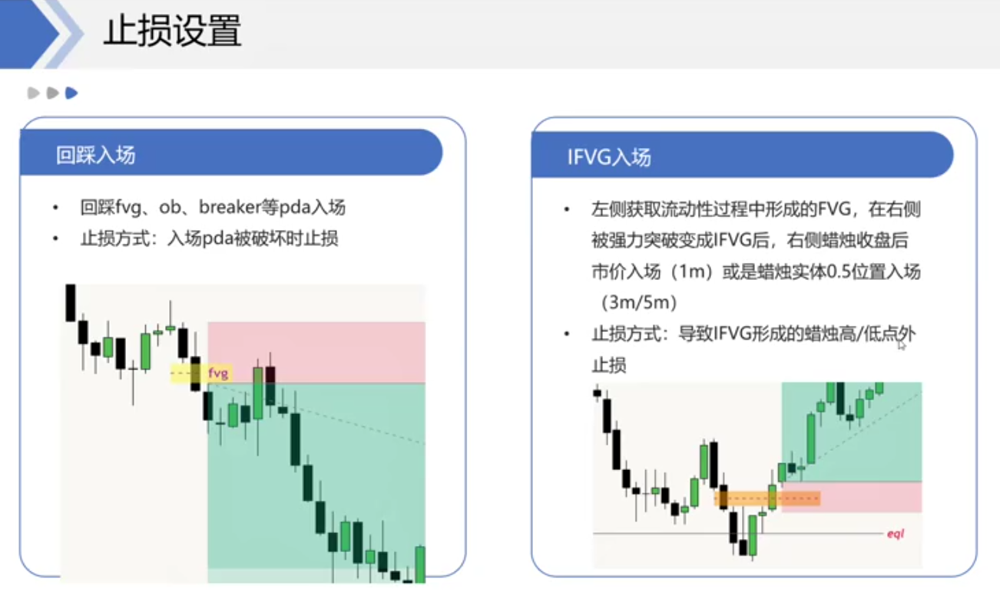

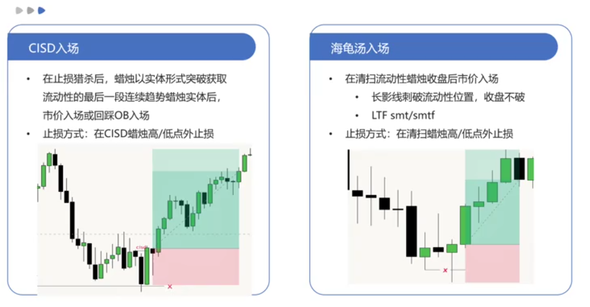
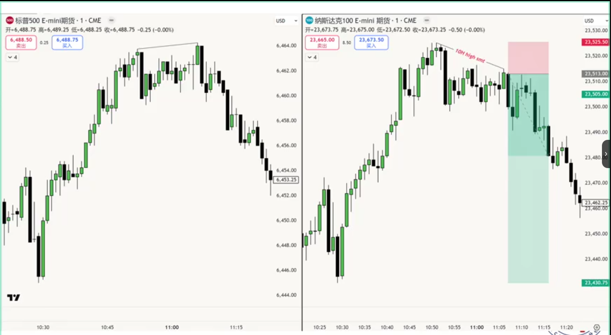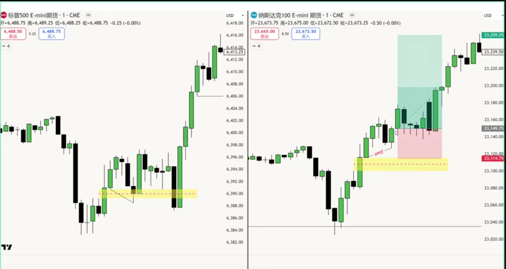

### 什么时候BE

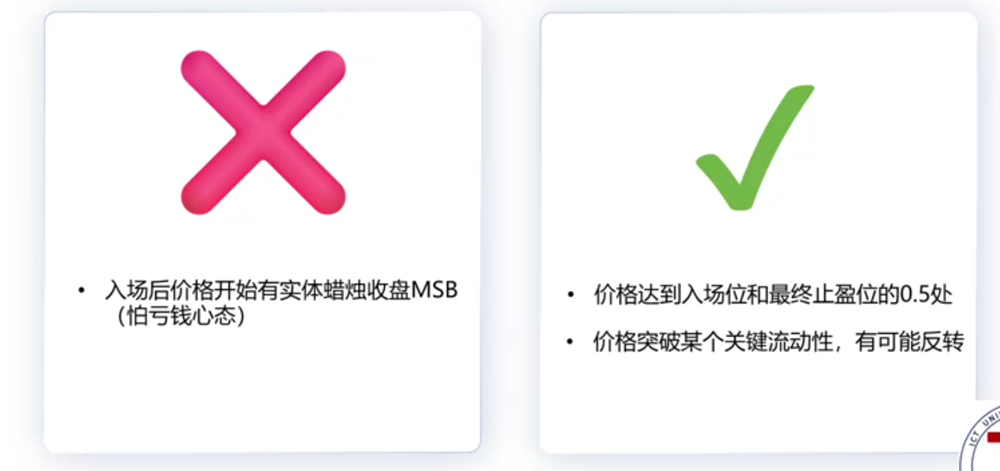

## 止盈

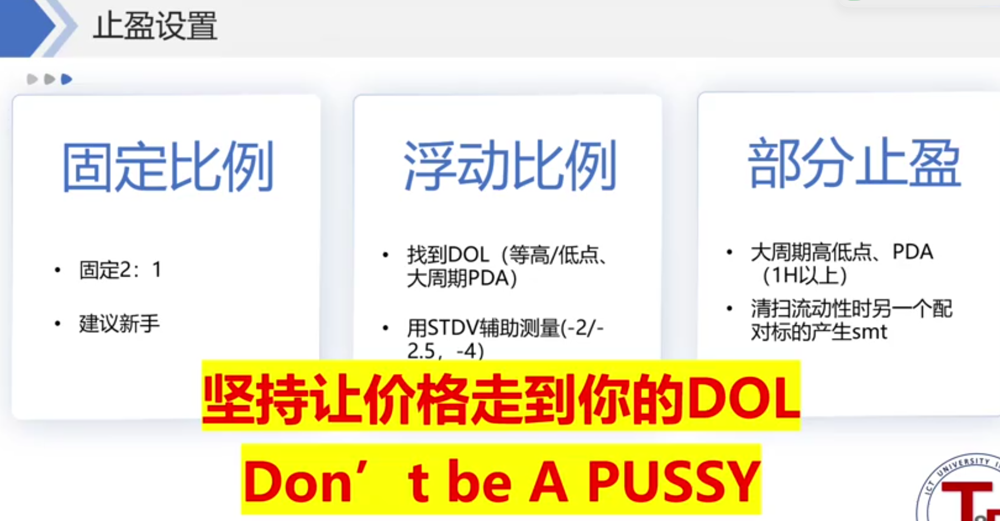

# 交易系统框架：完美京

> **交易时段：纽约上午盘 北京时间 09:30‑12:00；每日只做 2‑3 笔；不参与下午盘**

### 底层逻辑链

1. 大周期（日线、小时图 MMXM）定当日大方向
2. 亚洲盘 + 伦敦盘价格行为，推演当日 Daily Profile
3. 盘前完成全部分析计划，开盘只负责执行
4. 每日只二选一：**日线延续 OR 日线反转**

### 4、延续框架

适用 Profile：伦敦反转、单边扩张 **执行步骤**

1. 开盘等待价格回踩伦敦扩张形成的 FVG，遵守 nMO 新市场开盘规则
2. FVG 内部出现**1 分钟 SMT 低点** → 最优信号，海龟汤入场
3. 备选：1 分钟 MSS / CSD 完成，回踩 OB / FVG 入场（反转三要素）
4. 止盈：伦敦操纵段标准差 **‑2 ~ ‑2.5** 流动性点位

**异常处理**

- 开盘不回踩 FVG、无视 nMO 直接突破：暂停交易，观察 bias 是否切换
- 伦敦区间真实有效突破（不是扫流动性）：顺着突破方向，找下一个 PDR 做延续

### 5、反转框架

适用 Profile：纽约反转、Structure Destroy 结构破坏

> ⚠️硬性前提：**纽约盘必须先突破伦敦区间一侧；没突破 = 盘整，不开仓**

突破之后二分类：

1. **有效突破 → 走上面延续框架**
2. **流动性清扫 SMR（Smart Money Reversal） → 反转入场**

#### SMR 反转 4 条确认条件（尽量多条件共振）

1. 扫高 / 扫低，K 线长影线，实体收回到原有区间内部
2. 同步生成 CSD 或者 FVG
3. 大周期 HTF：PDR / 关键高低点抵达（日线 / 伦敦 / 亚洲高低）
4. 1 分钟级别 **SMT 错配确认（高概率）**

**入场两种方式**

1. 海龟汤：结合整点开盘高低点 + SMT
2. 等待 1min/5min MSS‑CSD‑FVG 反转信号，回踩入场

**反转止盈**

- TP1 保守：原盘整区间 **0.5 均衡 EQ 折扣区**
- TP2 最终止盈：原盘整高低点，标准差‑2 ~ ‑2.5

**时间加成 PO3**：小时 K 先向假方向诱骗，此时入场盈亏比最优；本周练习可以先忽略精细时间，优先看价格行为。

# 晚安北京

> 上图：9:30‑10:00分支；下图完整三层时间树：9:30‑10:00 /10:00‑11:00 /11:00‑12:00

## 9:30‑10:00（仅观测建PD Array，不主动开仓）

5条分支：开盘海龟汤、开盘延续、固定模式‑伦敦反转/单边扩张、固定模式‑纽约反转、需谨慎/规避场景

1. **开盘海龟汤** 1）小时级别以上清扫 → 针对伦敦时段 2）9:30后小幅度操纵，15m SMT；开盘初期偶尔出现，**9点后PO3阶段SMT概率更高** 3）1m Cisd：清扫直接市价入场；或1m cisd后市价入场，cisd极值做止损，对冲最近外部流动性止盈
2. **开盘延续**

- 等待第一个1m FVG出现
- 回踩出现1m SMTF，或回踩形成1m SMT
- SMT入场，第一个FVG三根K中首根蜡烛被突破止损 /SMT极值止损

1. **固定模式⭐⭐｜伦敦反转 / 单边扩张（为10点延续做铺垫）**

- 回踩伦敦时段扩张留下的1h/15m FVG
- 产生SMTF /1m SMT
- 海龟汤入场，1m SMT出现后继续持仓
- 等待1m Cisd/FVG入场

1. **固定模式⭐⭐｜纽约反转（为10点反转做铺垫）**

- 亚洲收盘高阻力单向运行
- 9点小时蜡烛获取外部大周期流动性/PDA
- 小时级别清扫SMT +9点小时PO3极值SMT
- 9:30后15m清扫SMT
- 1m Cisd/FVG

5. **谨慎&规避条件（不要交易）**

- 周一、周五开盘
- NQ和ES走势完全相反的时候
- 开盘来回吞噬9:30 open以及第一个FVG

---

## 10:00‑11:00（⭐核心窗口，做延续 / 做反转二选一）

### 做延续｜单边扩张 /伦敦反转

1. 看4h、1h实体收盘cisd/mss，确认9点小时蜡烛完成后延续趋势
2. 9点小时蜡烛扩张产生5m/15m FVG
3. 等待10点PO3操纵进程进入FVG，SMTF /10点及时SMT
4. 海龟汤：产生SMT 1m收盘收影线
5. 突破：产生SMT后1m cisd/fvg信号进场
    
    > 过滤规则：出现**逆趋势单向极值SMT**，预示10点小时蜡烛盘整深度回调；放弃本窗口，等待11点PO3
    

### ⭐⭐做反转｜纽约反转

1. 10点K线清扫9点小时蜡烛极值，进入大周期PD Array
2. 15m SMT /10点PO3极值SMT
3. **10:30前后90min SMT，胜率大幅提升**
4. 1m cisd/fvg/mss
5. 1m SMTF
    
    > 确认不足：等待5m Cisd确认
    

---

## 11:00‑12:00（⭐做回调；次要：做延续）

### 做延续

- 适用：10点小时蜡烛是盘整；整套步骤复制10点延续
- 11点PO3重复10点延续逻辑；等待PO3操纵进入前期扩张5m/15m FVG，SMTF /11点及时SMT

### 做回调（允许反转，有限回调，非大级别反转）

前置：**9点、10点小时蜡烛同向扩张**

1. 11点K清扫10点小时蜡烛极值，获取外部大周期流动性
2. 等待：最后一段盘整 + 最后一波冲击清扫流动性结束；冲击完成后，反向入场 cisd/mss
    
    > ⚠️周期陷阱：不要只看到1m mss就进场，需要尊重5m FVG；1m信号有可能仅为回踩，不是反转
    
## 极简盯盘勾选版（可直接复制打印）

### 🕘9:30‑10:00 仅收集PD，不开仓

- 周一/周五开盘？ → 不做
- ES NQ走势严重背离？ → 不做
- 价格反复吞噬开盘+首根FVG？ → 不做
- 记录：9点小时K、FVG(5/15m)、SMT、外部流动性、protected high/low

### 🕙10:00‑11:00 二选一，只允许一个方向

▷ 延续（单边扩张/伦敦反转）

- 9点小时K实体强，无长影
- 5/15m FVG存在
- PO3回踩进入FVG
- FVG内：SMTF /10点及时SMT
- 过滤：出现逆趋势单向SMT → 放弃，等11点
- 入场：海龟汤 ｜ 1m CSD/MSS
- 设置protected high/low，击穿离场

▷ 反转（纽约反转）

- 10点K清扫9点小时极值
- 价格进入大周期PD Array
- 15min SMT ✔
- 【加分】10:30 90min Session SMT
- 入场确认：1m CSD / MSS；不稳就升级5min CSD
- 设置protected high/low，击穿离场

### 🕚11:00‑12:00

▷ 延续：复制10点延续，时间替换11点 ▷ ⭐回调交易（仅9+10点连续同向大扩张）

- 11点K清扫10点小时蜡烛极值
- 抵达大周期外部流动性
- 盘整 + 最后一波冲击扫止损完成
- 确认信号 CSD / MSS
- 避坑：不能仅靠1min MSS，要看5m FVG是否被破坏
- 目标0.5均衡，分批止盈，不硬扛、即使be

### 总结

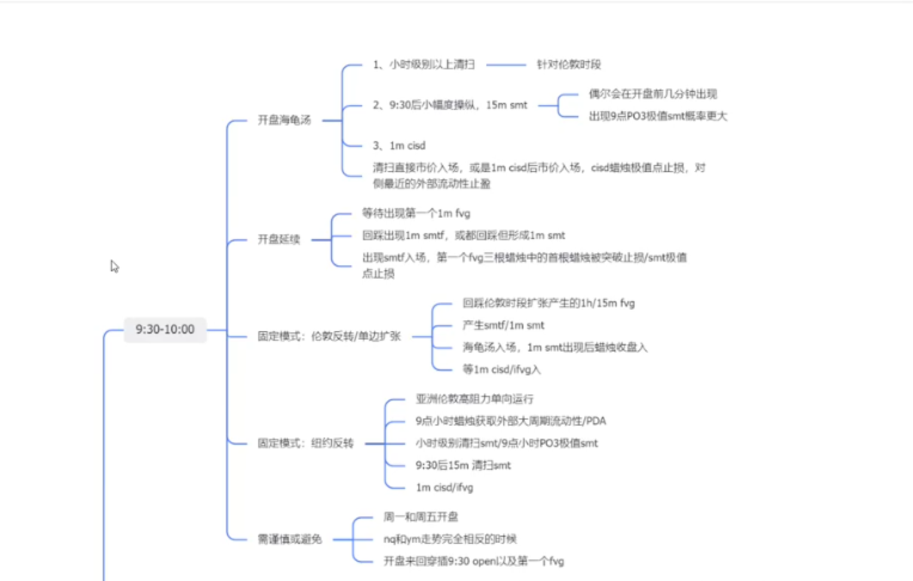

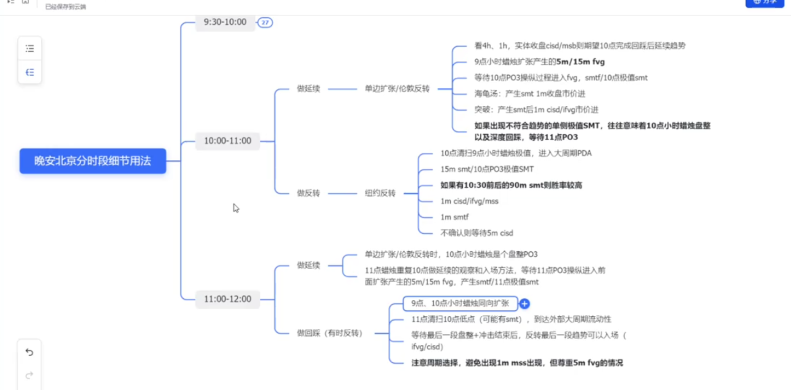

# 交易框架 ⭐ ⭐

> 核心一句话：**大周期4H/1H定流动性循环，5min判定反转，5min/1minPD挂单入场，跳过多层嵌套时间框架**

## 一、三层时间架构（固定，不搞多周期嵌套）

1. **方向层｜4H + 1H** 判断行情是要去**外部流动性**，还是回踩**内部流动性**，定大方向。
2. **反转层｜5min** MSS / CSD / VG 识别反转；**不使用1min做反转判断，减少频繁扫止损**。
3. **入场层｜5min / 1min** 寻找PD阵列，执行挂单/市价入场。

> ❌ 摒弃：日线→1H→5min、4H→15min→1min这种层层嵌套模式。

## 二、步骤1：内外部流动性循环 + 交易区间⭐

底层逻辑：价格在**外部流动性、内部流动性**之间循环往复

- 拿到外部流动性 → 回撤回补内部流动性
- 内部流动性回补完毕 → 再度扩张，去进攻新的外部流动性

### 区间画法

起点：**最后一次反向清扫（反向操纵）的K线位置** 终点：本轮获取外部流动性的极值高点/低点 画完区间，拉斐波那契，保留 **0.5、OTE** 两个关键位置。

### 区间两种用法

1. **外部→内部（行情走完，开启回撤）** 触碰外部流动性后开始回踩，最低目标**0.5位置**；深度回撤会抵达OTE/1位置，这里会出现PD阵列。
2. **内部→外部（回撤结束，延续趋势）** 0.5/OTE附近PD回补完成，行情继续朝原有方向，进攻新外部流动性。

> 要点：同一K线图可以画出多套区间（做多视角、做空视角），**逻辑自洽即可，行情走出来前没有唯一标准答案**。 ✨0.5铁律：趋势行情如果从来没有回踩过区间0.5，代表趋势并未终结，后续大概率会回归0.5。

## 三、步骤2：MMM + HRLR（盘整行情辅助工具）

适用场景：震荡盘整，内外流动性分不清的时候

1. **MMM 做市商模型（1H级别）** 识别当前处于MMM哪一个阶段；如果右侧冲击段尚未走完，**不预判反转，只顺势交易**。
2. **HRLR 高低阻力流动性**

- **HRL高阻力运行**：长时间盘整，留下大量未被清扫的反向高低点；一旦反转，这些点位会被快速打掉。重点留意散户集中止损位、对等高点/低点。
- **LRL低阻力运行**：行情快速突破，几乎没有盘整。

## 四、步骤3：PD阵列（关键订单流结构）⭐

重点4类，可简化为：`FVG + 高低拐点Swing High/Low`

1. FVG公允价值缺口（细分）

- Field Gap（最近）
- Tap Gap（中间）
- Breakaway Gap（最远，突破缺口，**预期不会回补**）

2. OB 订单块
3. Rejection Block 拒绝块
4. Swing High/Low 波段高低点

> 提示：黄金、加密货币，不同品种PD行为会有差异，要适配品种特性。

## 五、步骤4：CRT清扫原则（高胜率前置条件）⭐

> 几乎所有反转，都会出现CRT；不要价格刚踏入PD阵列就直接进场。

**CRT(Candle Range Trap，K线区间陷阱)**定义： 价格进入大周期PD阵列之后，会先**清扫进入PD那根K线的极值（高点/低点），但是K线实体不突破该极值，收盘收回PD内部**。

级别严格对应：

- 4H的FVG/OB → 需要等待**4H级别CRT清扫**
- 1H的FVG/OB → 需要等待**1H级别CRT清扫**

流程：价格进入PD → CRT清扫完成 → 切换到5分钟图表，等待反转信号。

> 会出现一次、二次甚至多次清扫，不要急着进场。

## 六、步骤5：5min反转确认（CRT完成之后才看）

三个反转判定工具：

1. **MSS市场结构转变**：实体K线突破波段拐点Swing点
2. **CSD收盘价结构转变**
3. **VG成交量缺口**

### ⚠️重要风险提醒

5min出现反转信号，但更高周期（15min）还有未回补完毕的PD阵列（FVG/OB）：

- 这有可能仅仅是回补大周期PD，**不是真正反转** 处理方案：

1. 等待大周期PD被完全击穿之后再开仓；
2. 或者仓位降低，设置分批止盈。

## 七、步骤6：入场、止损、止盈

|反转信号|入场方式|
|---|---|
|MSS过程生成FVG|FVG区间挂限价单|
|CSD / VG|直接市价进场（行情不回调，不给挂单机会）|
|BPR平衡价格区间|等待BPR二次回踩入场|
|多个重叠FVG|优先选择和Breaker（突破块）重叠的缺口位置|

- **止损**：放在破坏当前PD结构的外侧（PD失效位置）
- **止盈**
    1. 第一目标：区间0.5位置，**部分减仓落袋**
    2. 终极目标：远端外部流动性，分批全部离场
    3. 中途辅助止盈：参考HRLR遗留未清扫高低点、对等高低点。

---

# 极简执行流程图（方便复盘抄作业）

1. 1H画流动性区间，区分现在是去外部还是回内部流动性
2. 盘整就用MMM+HRLR辅助判断
3. 等待价格抵达PD阵列(FVG/OB等)
4. **必须等对应级别CRT清扫完成**
5. 切5min，等待MSS/CSD/VG反转信号
6. 5min/1min PD位置挂单/市价入场
7. 止损放PD失效位置；0.5减仓，远端流动性全部离场

# 跨品种交易框架（黄金 + BTC）整理

> 适配 SMC，跨品种通用，**5 步完整流程**，黄金、大饼共用一套规则，仅细节微调

## 五步完整流程

1. **绘制交易区间** 以关键 PD 阵列（4H FVG、OB 订单块）定义交易区间； 如果原始区间过大（月线级别），降周期到**4H**，取最近 PD 重新画区间。
2. **等待流动性清扫 Sweep** 等待价格清扫区间边界的高点 / 低点流动性； ⚠️必须是**同周期级别清扫**，清扫完成，区间才生效。
3. **反转信号确认** 清扫结束后，等待信号：`MSS / CHoCH / CSD`

- 如果 5 分钟 CSD 信号弱，被连续 FVG 压制：不能直接进场，升级到**15min 级别确认**，或者等待突破前高 / 前低。

4. **入场（反转确认后切 1 分钟图）** 二选一，取舍胜率 vs 盈亏比 ① **限价挂单 FVG 回踩**：盈亏比高，但是行情不回调会直接踏空； ② **1min 直接市价入场**：成交机会多，盈亏比被压缩（举例：4.88 → 2.47）。
5. **止损 & 分批止盈**

- 止损：放置在 5min FVG 外侧；这套框架本身止损距离偏大。
- 止盈分批：
    - 第一目标：前期被清扫的高低点，盈亏比大约 1:4；
    - 终极目标：大周期未回踩的 0.5 位置 / 外部 PD 阵列。

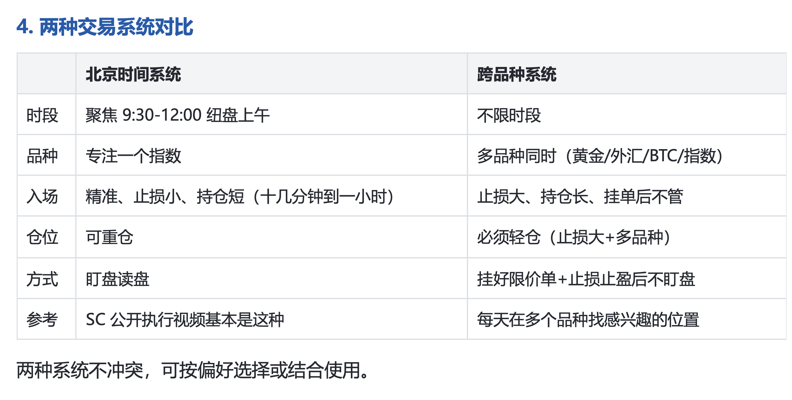
# 避免错误清单

|项目|含义解读|
|---|---|
|✅系统信号入场|只按照你的交易模型信号开仓，不主观随手下单，杜绝情绪交易|
|✅冷水暂停|连续亏损几笔之后强制停止交易，冷却心态，防止报复性加仓|
|✅目标位离场（固定止盈 / 拖动止损）|提前定好止盈位置；可以用移动止损，让利润奔跑，不主观提前乱平仓|
|✅逻辑止损|止损不是随便设点数，放在结构流动性之外，是行情逻辑失效的位置，不是固定点数|
|✅ticks 显示|打开盘面 tick 逐笔数据，观察流动性，辅助判断真假突破|
|✅日亏限额|设置单日最大亏损，亏到额度立刻停止当日所有交易|
|✅切号隔离|模拟账户、实盘账户严格分开，不要拿模拟盘心态做实盘，避免混淆|
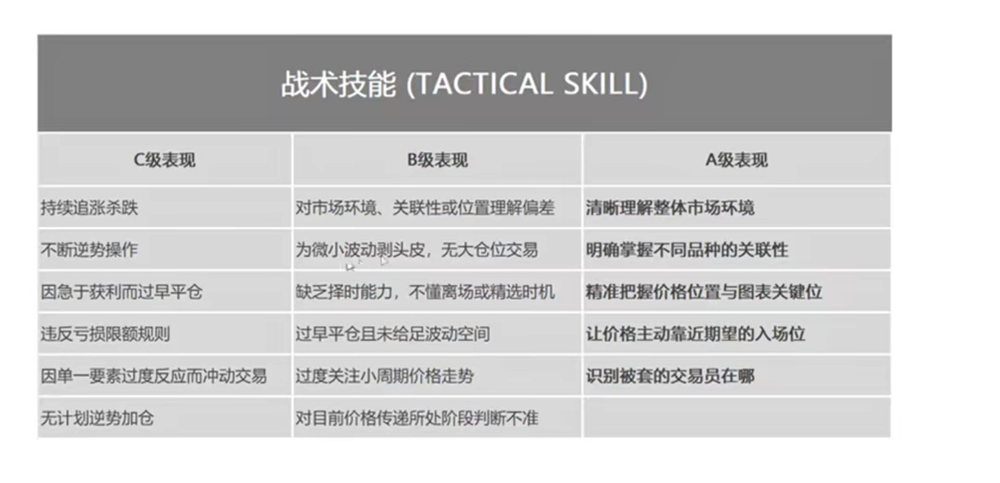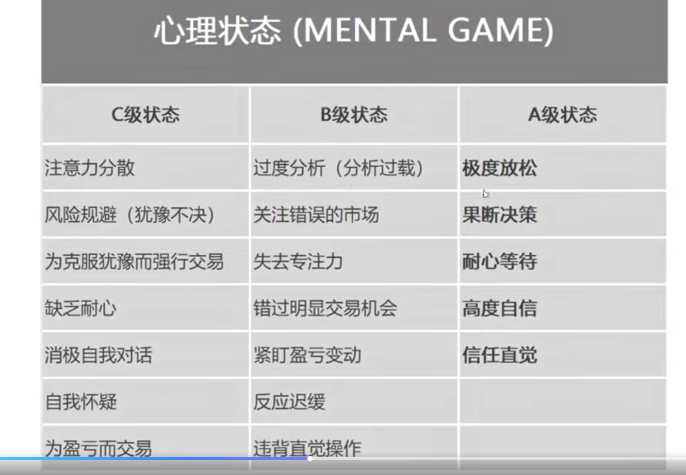

# 模型 

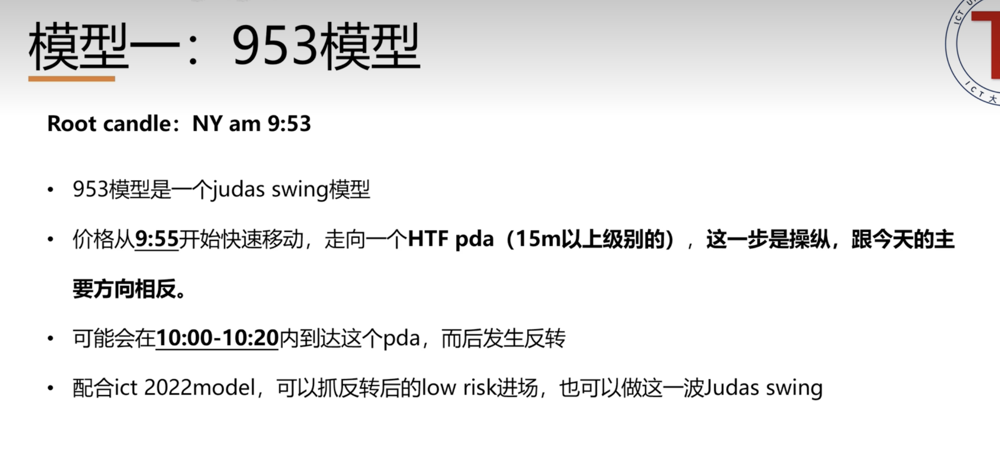

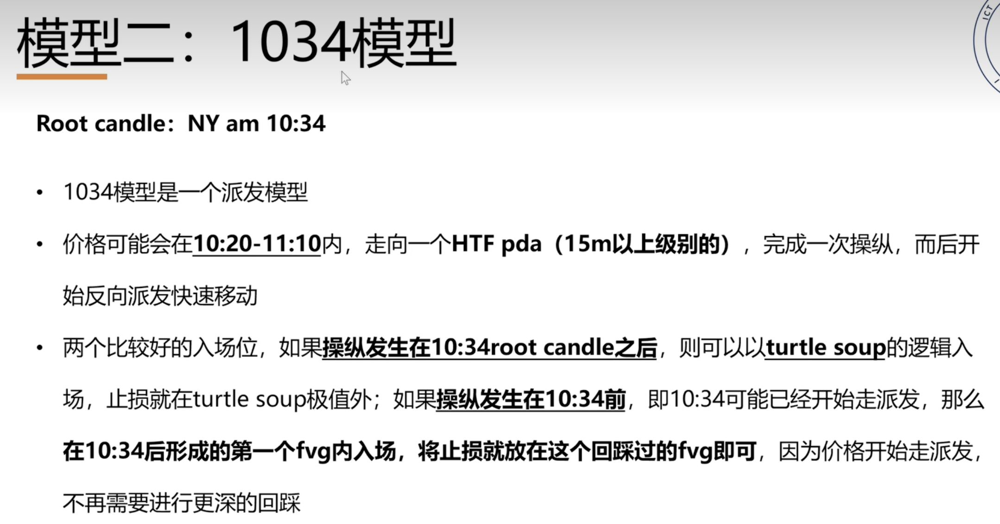