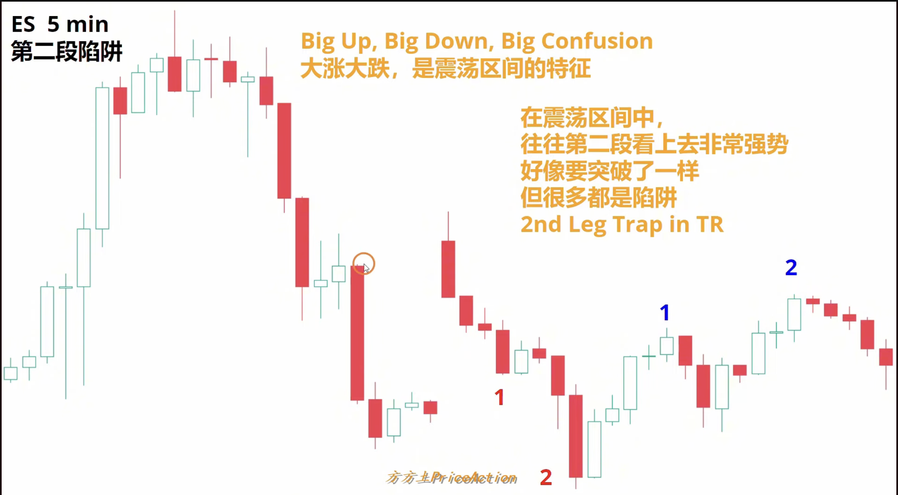
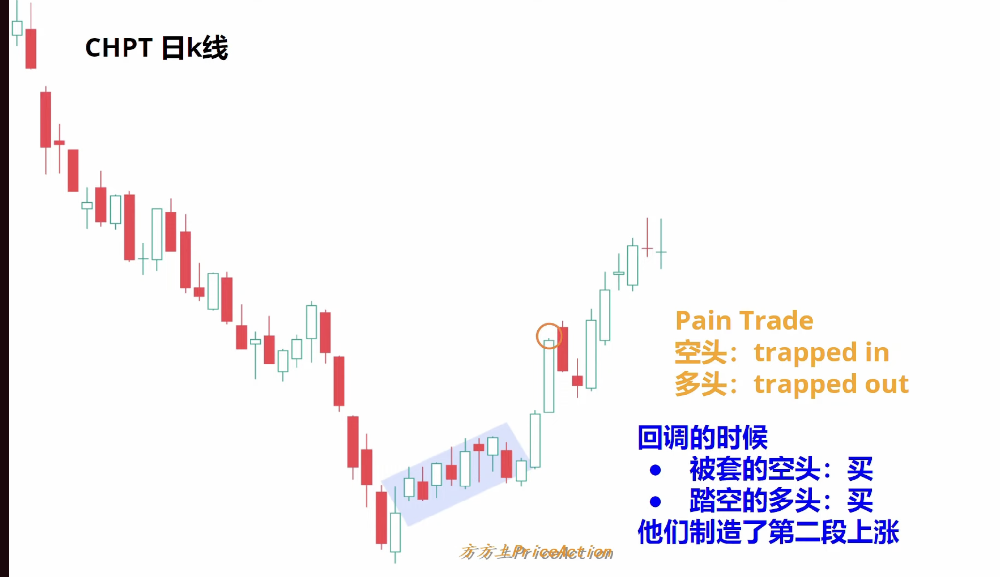

# 防止

**开盘前后 半小时 尽量不要玩**

# 信号K

**一般的信号K 需要配合背景和趋势**

# 突破（反转）专题

## 1.假突破

- 为什么很多突破会失败？**市场有惯性震荡区间的突破80%都会失败**
- 什么样的突破成功率高？**突破都会有好的跟随、会制造缺口

## 2. 真突破

- 反转也是突破（没有好的跟随）仅仅是回调（反弹）
- 真突破的特征
	- **突破K的体积大**
	- **收在最高/最低，几乎没有影线**
	- **离之前的区间足够远**
	- **被突破的K线数量多（突破的最高/最低点中间的K线数量多）**
	- **突破K有急迫感/有缺口**

## 3.第二段行情

#### **在震荡区间往往第二段看上去非常强势，好像要突破一样，但是很多都是陷阱**

#### 小概率事件&惊喜K线

**小概率事件一但发生就会延续这个情况**
突破之后往往会有第二段行情
一句话总结
• 情况: 回调浅 + 突破点变支撑 + 回调K线弱; 判断: **第二段是真的，跟进**
• 情况: 回调深 + 突破点守不住 + 出现强反向K线; 判断: **是陷阱，准备反手**

### 突破回测 Breakout Test

