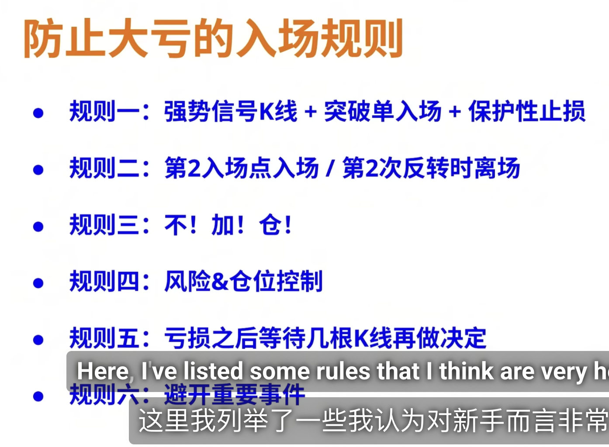
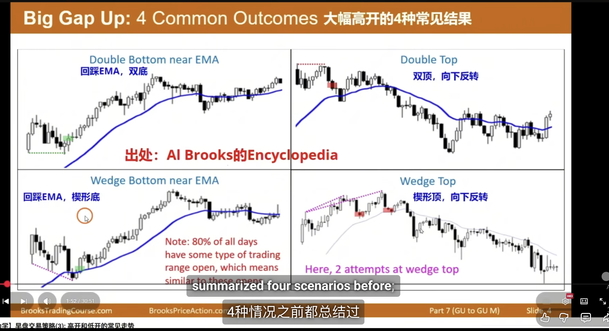
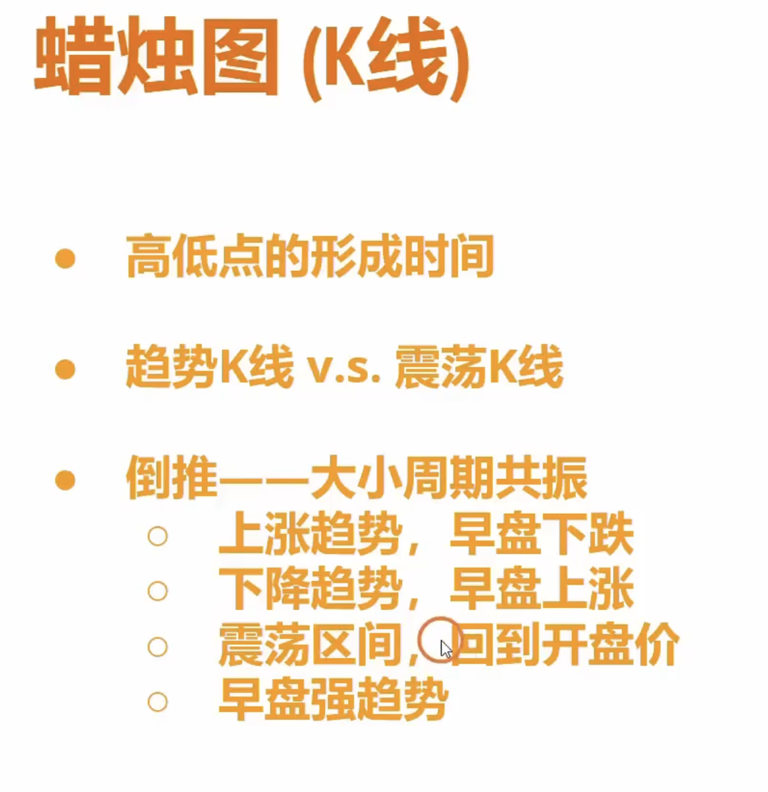
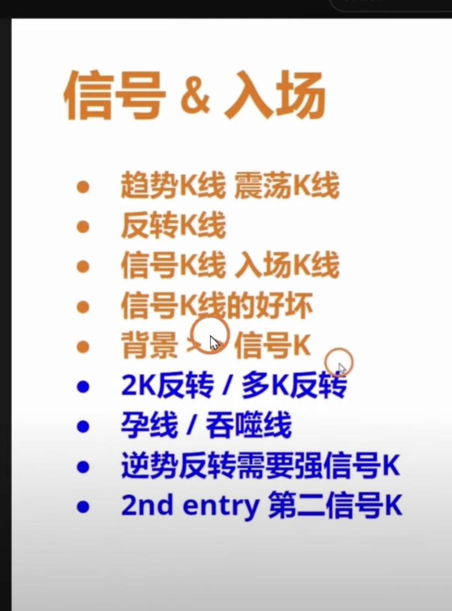
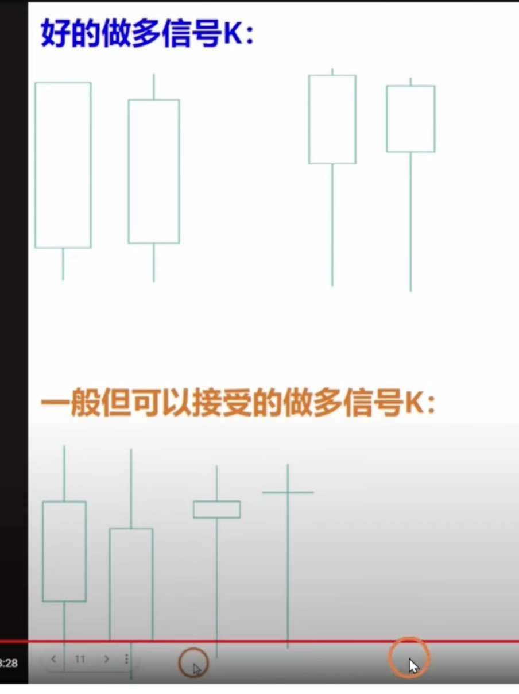
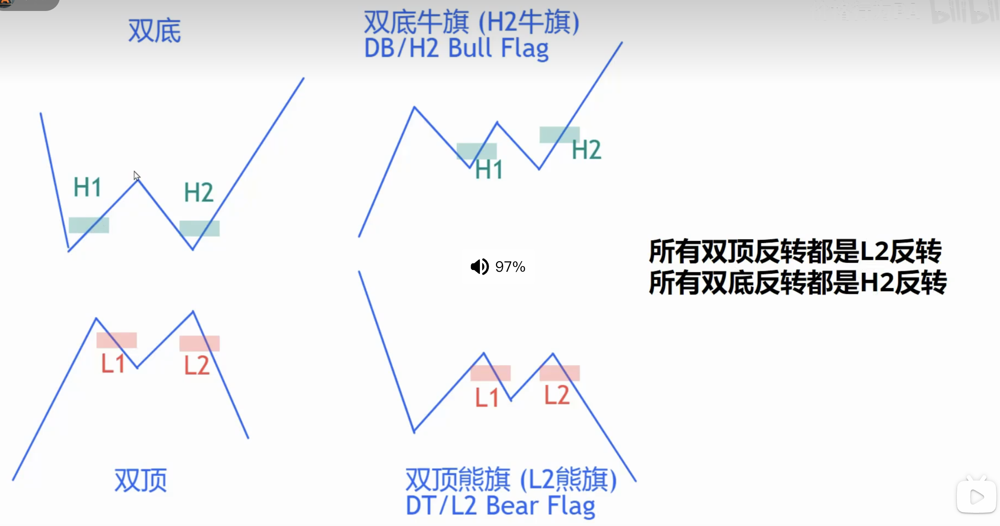
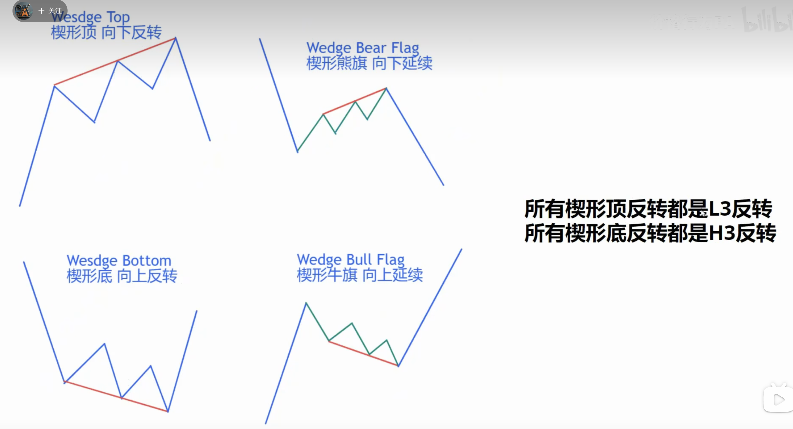
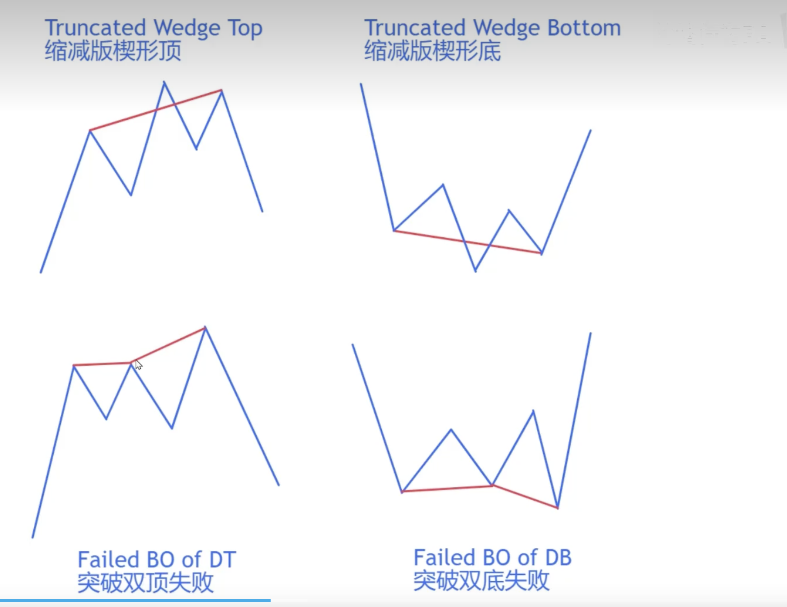

# 防止

**开盘前后 半小时 尽量不要玩**

# 信号K

**一般的信号K 需要配合背景和趋势**

# 突破（反转）专题

## 1.假突破

- 为什么很多突破会失败？**市场有惯性震荡区间的突破80%都会失败**
- 什么样的突破成功率高？**突破都会有好的跟随、会制造缺口

## 2. 真突破

- 突破需要跟随和确认
- 反转或者仅仅是回调
- 真突破的特征
- 成功的突破有第二段
- mm测量目标位