# 多重时间框架

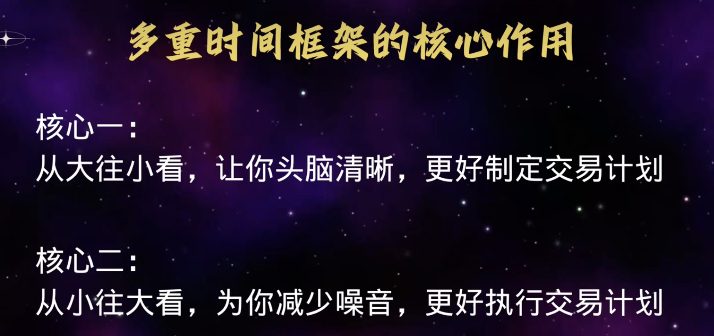

## 核心一

在大周期定好偏见和目标doc、切到小周期找点位和找机会、

**HTF**（大周期）=定大方向的doc、制定交易计划
**LTF**（小周期）= 变现出该有的反应、复合我的doc
只有HTF和LTF复合才能开始执行交易

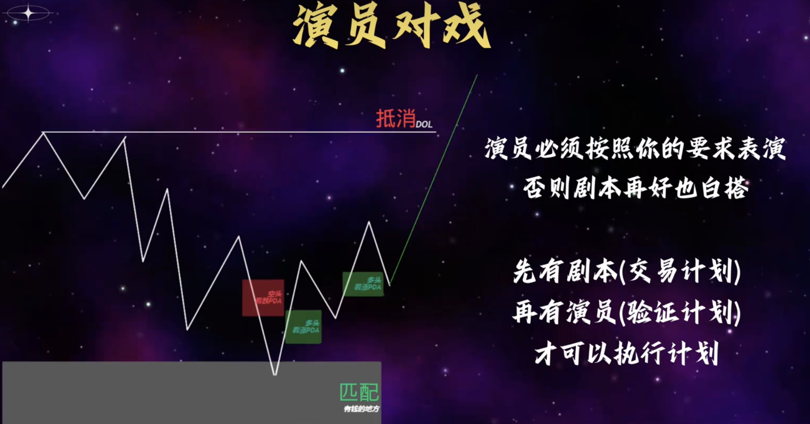

反应也是有要求的。
**买点1**:触碰到匹配区域反弹 。 （1手）
**买点2**:看跌fvg 被吞没形成新的看涨fvg然后等看涨fvg被验证有效、（2手）
**买点3**:匹配区域有反应且超过前一个看跌的摆动高点、回落验证看涨的fvg再买入。（2手）

## 核心二

5min - 15min
日- 周

# MMXM

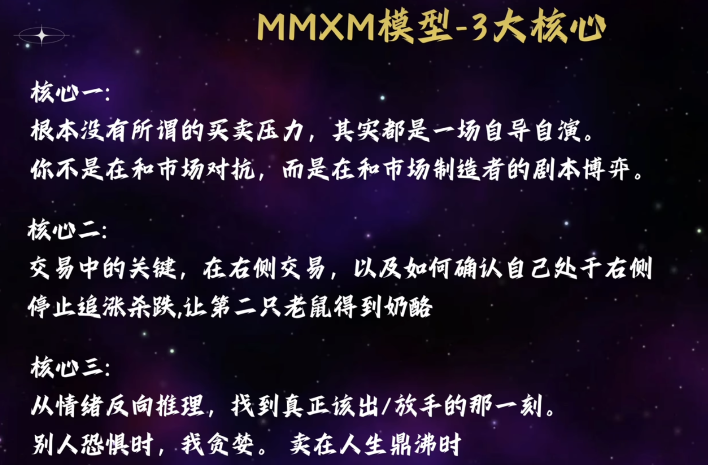

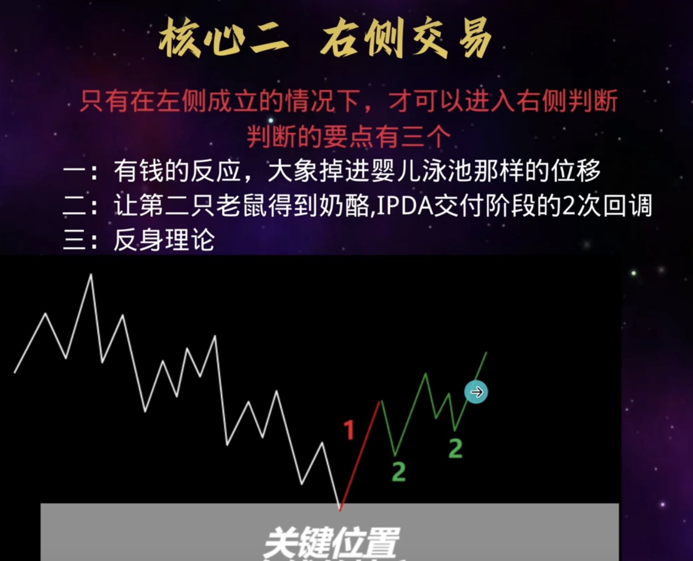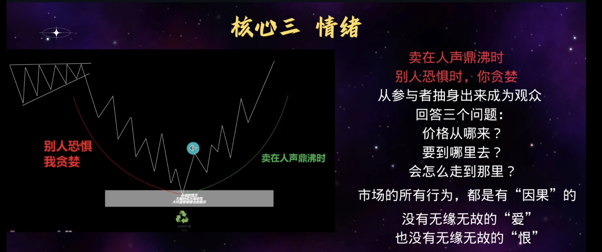

# 不同的交易模型

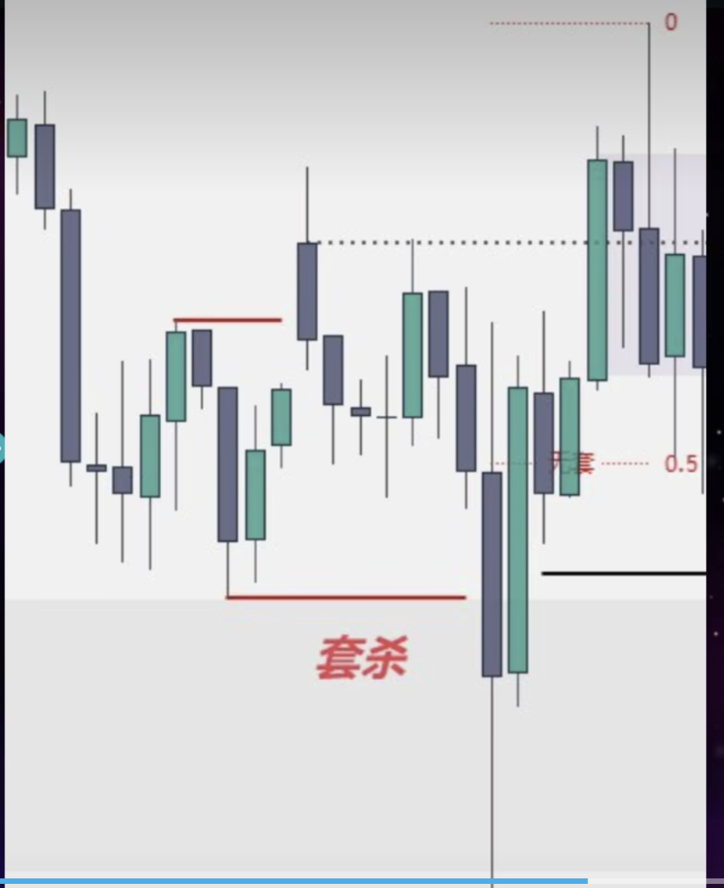
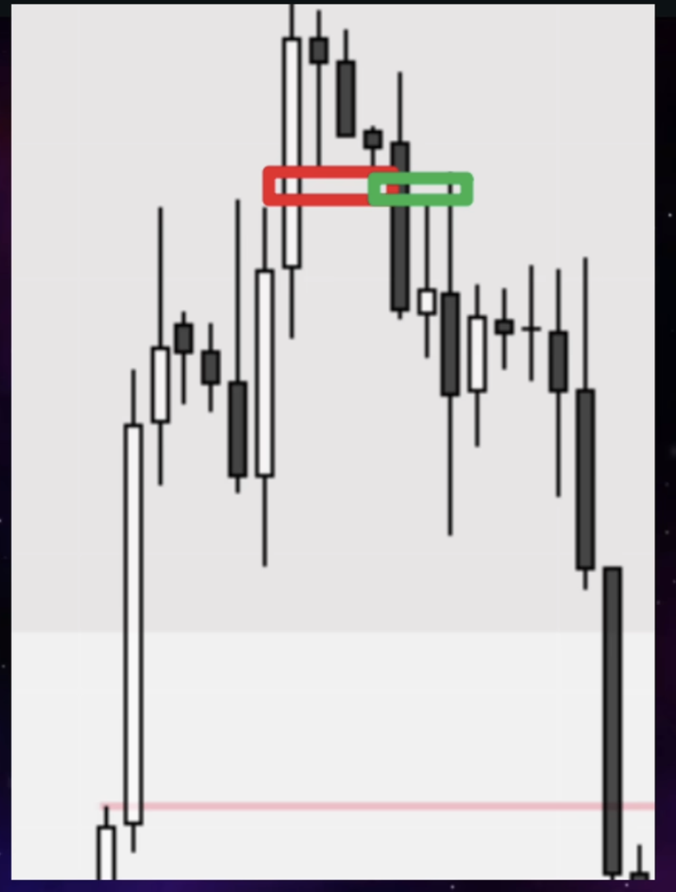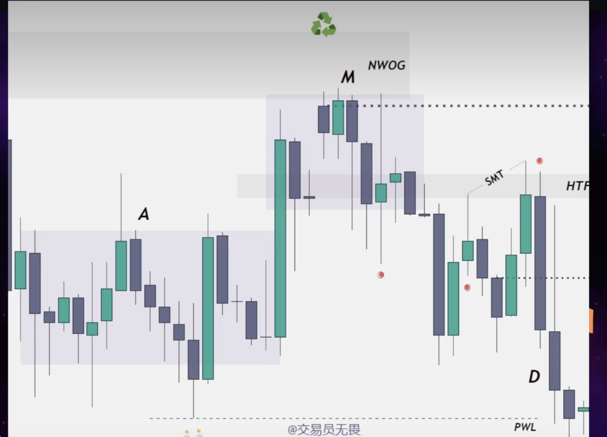

# 高级市场结构

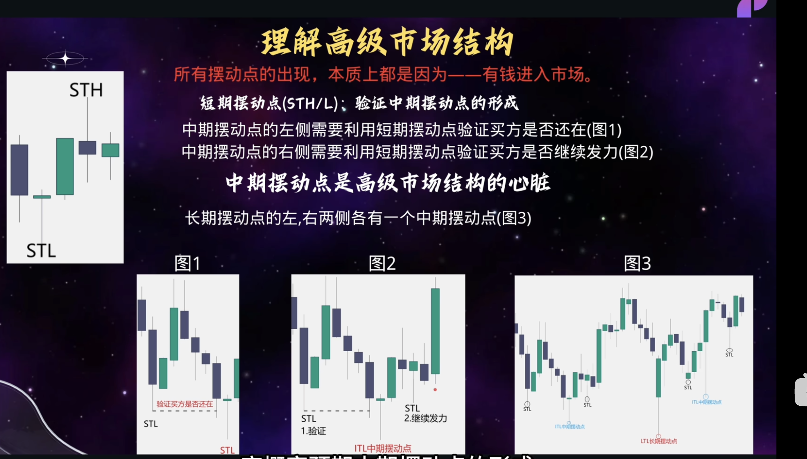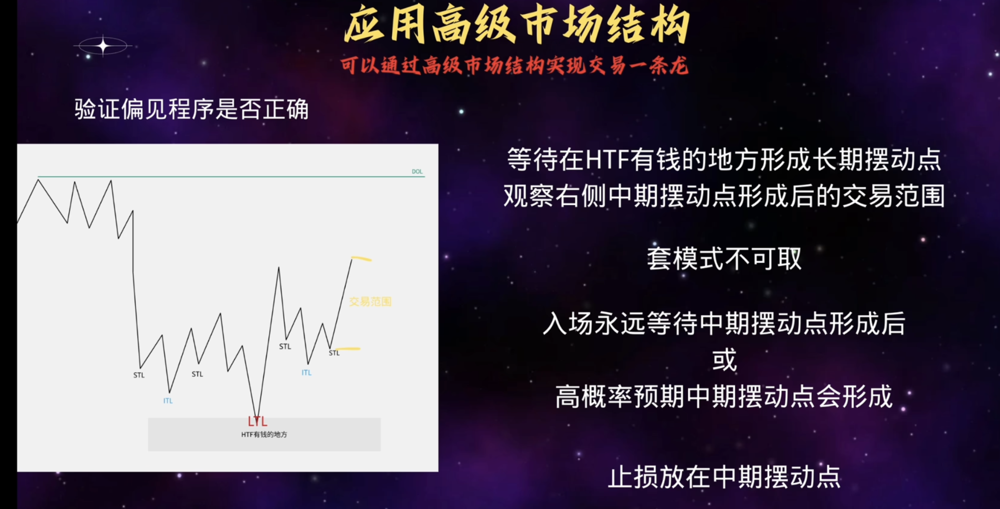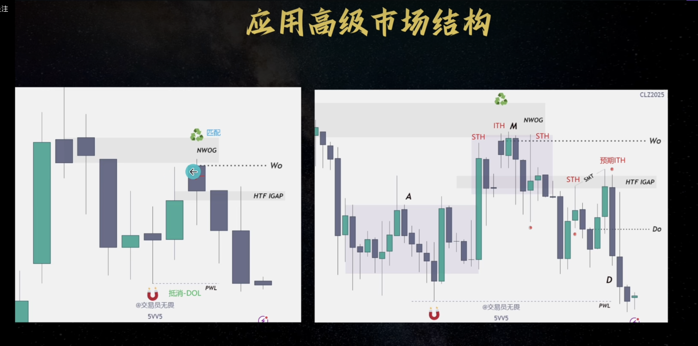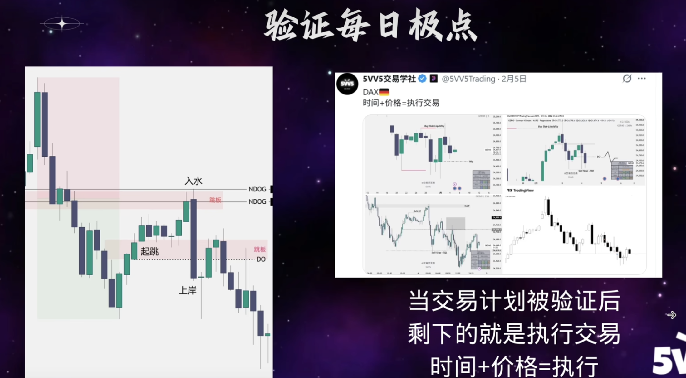

# 红绿灯模型

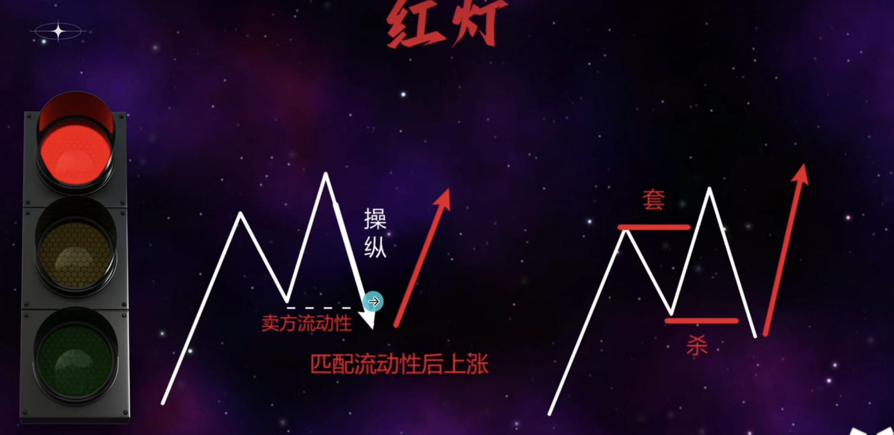
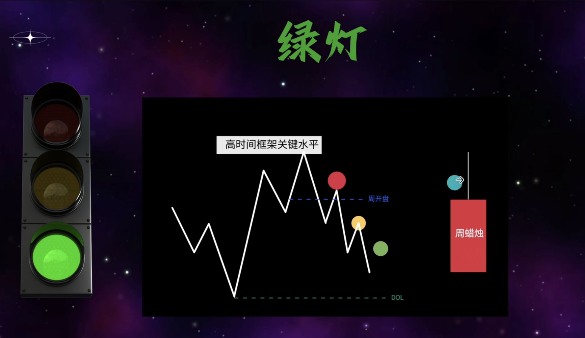

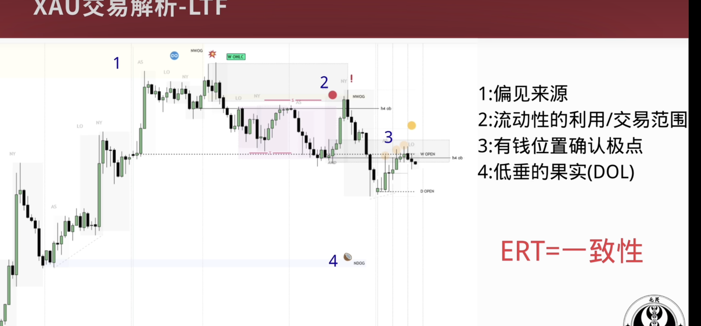