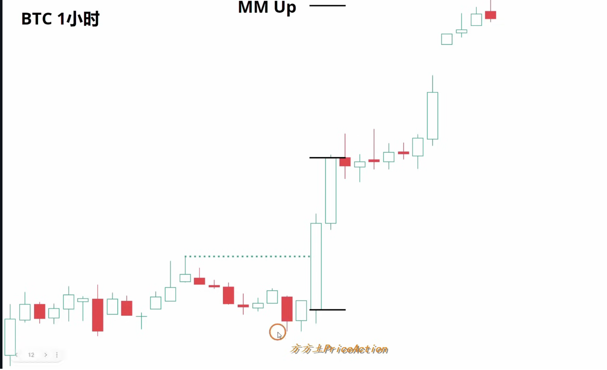
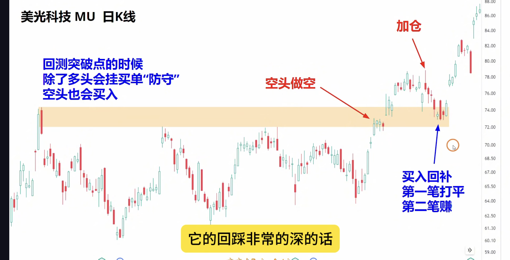
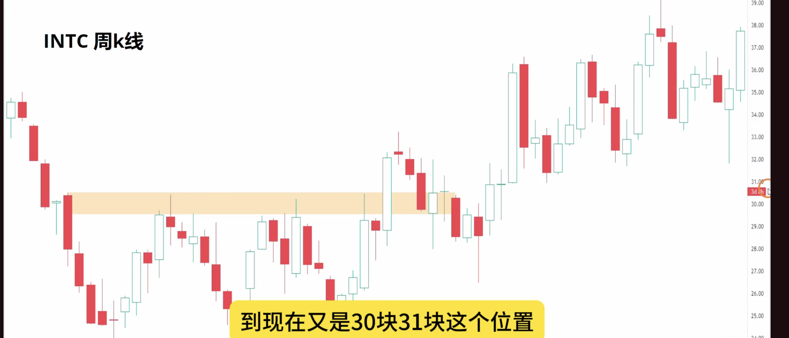

## 1.假突破

- 为什么很多突破会失败？**市场有惯性震荡区间的突破80%都会失败**
- 什么样的突破成功率高？**突破都会有好的跟随、会制造缺口

## 2. 真突破

- 反转也是突破（没有好的跟随）仅仅是回调（反弹）
- 真突破的特征
	- **突破K的体积大**
	- **收在最高/最低，几乎没有影线**
	- **离之前的区间足够远**
	- **被突破的K线数量多（突破的最高/最低点中间的K线数量多）**
	- **突破K有急迫感/有缺口**

## 3.第二段行情

#### **在震荡区间往往第二段看上去非常强势，好像要突破一样，但是很多都是陷阱**

## 4.小概率事件&惊喜K线

1. 震荡趋势很久（20-30根K线）、出现惊喜K线，突破区间，行情往惊喜K线方向发展。（小概率事件）**小概率事件一但发生就会延续这个情况**
2. 如果是窄通道出现惊喜K线，行情往震荡方向发展。

### 5.突破回测 Breakout Test

#### 突破不一定会回测突破点

**没有完全回测的突破口 = 缺口**

#### 浅回踩
回踩test的特征：
✅ 回调幅度浅，没有回到区间内部
✅ 回调K线小，没有强势阴线
✅ 橙色线（原阻力）变成了支撑
✅ 守住后立刻出现上涨K线

#### 深回踩

造成了宽通道：说明了上涨趋势弱、迟早会📉

**权重至上而下**
• 判断标准: #橙色线; **真回踩**: 变成支撑; **假回踩:** 守不住

• 判断标准: #回调K线; **真回踩**: 小，无力; **假回踩**: 大阴线，空头主动
• 判断标准: #确认K线; **真回踩**: 阳线反弹; **假回踩**: 继续下跌或震荡

• 判断标准: #回调深度; **真回踩**: 浅，橙色线附近止住; **假回踩**: 深，跌穿橙色线

• 判断标准: #后续; **真回踩:** 第二段上涨; **假回踩:** 回到区间内部

