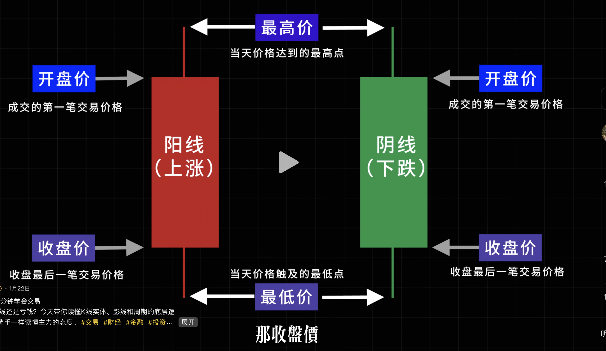
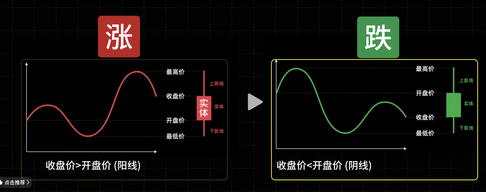
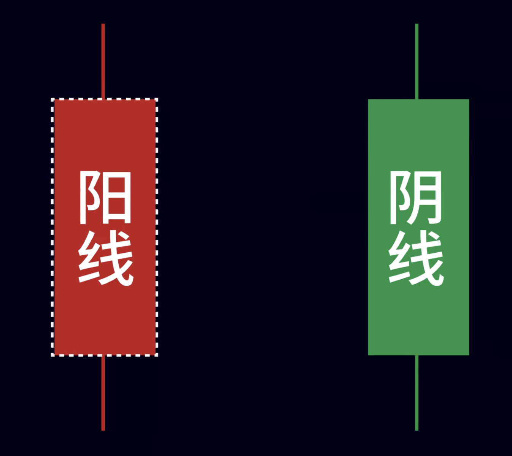
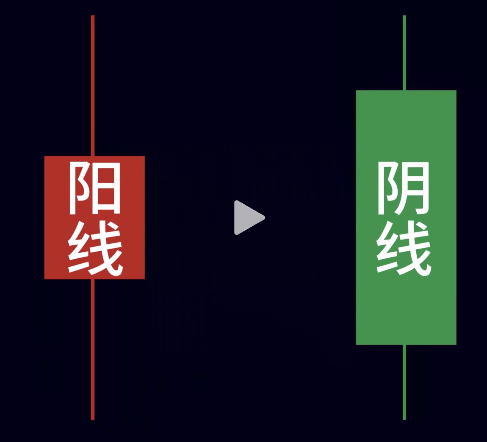
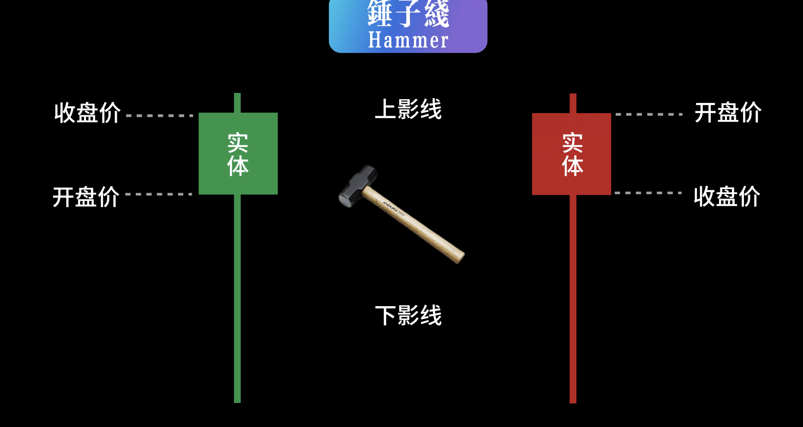
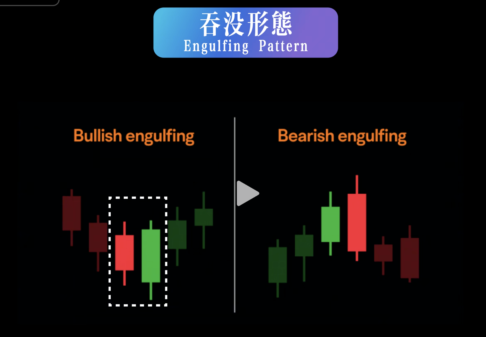
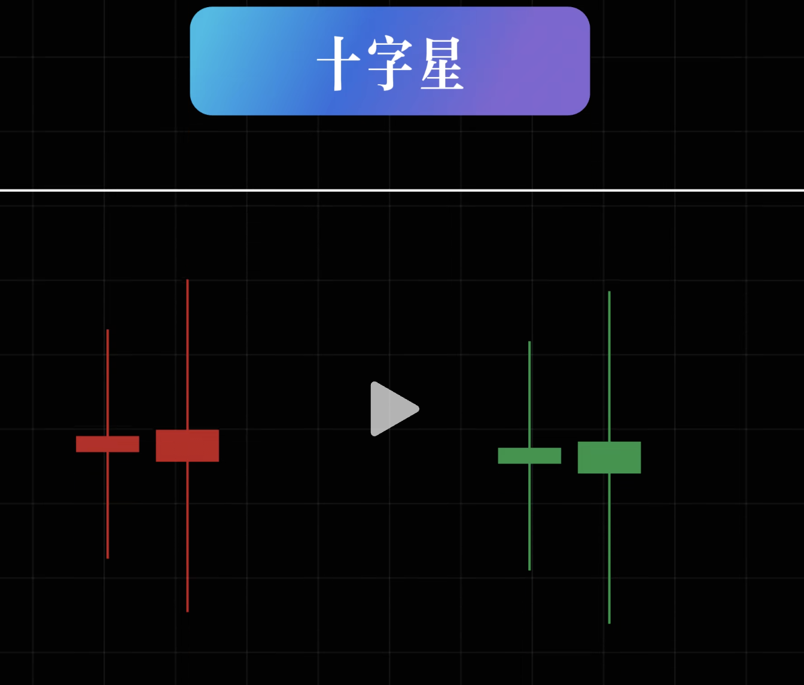
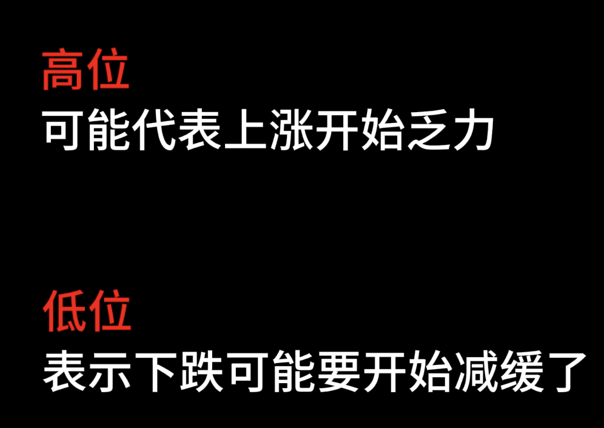
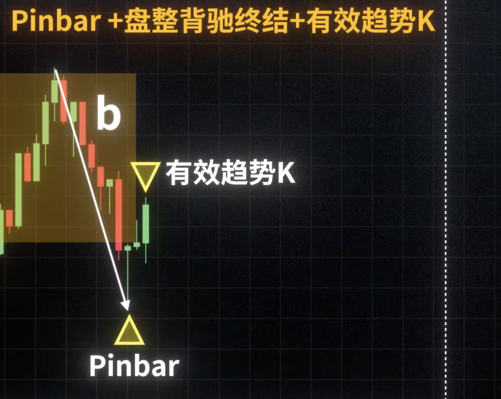

# 不要为了入场而入场（强入场）

1. 上隐线跟k线实体差不多说明 有压力
2. 下隐线 长 说明是有支撑的 容易弹回去
3. 沿着趋势线 鼓包的情况多的话要谨慎 尽量不要做、如果做了 找好设置止损的、或者一旦上去了 尽量保成本
4. 就算破了趋势线 也要对比阴阳线实体对比

# 趋势K判断

1. 趋势 K 本身的实体大小（50%以上）
2. 趋势 K 的影线加分 / 扣分项
3. 附近的反向 K 对比
4. 附近其他的不利因素

# K线

收盘价是最后多空双方认可的**价格**

### 实体的长度代表胜利方的优势有多大

###  这样的话就赢的不轻松

###  锤子线

**简单说就是：价格被砸下去但是又被拉回去了、阻力很强**

### 吞没形态

第二根线**实体部分**完全**包住了前一根K线**

**短期主导权 切换到另一方**

### 十字星

代表：多空不分上下，**平衡状态**

### pinbar

反之一样。

