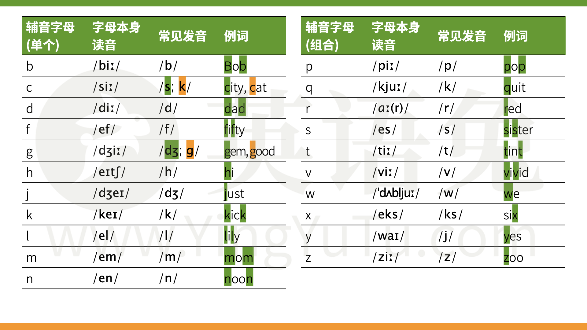
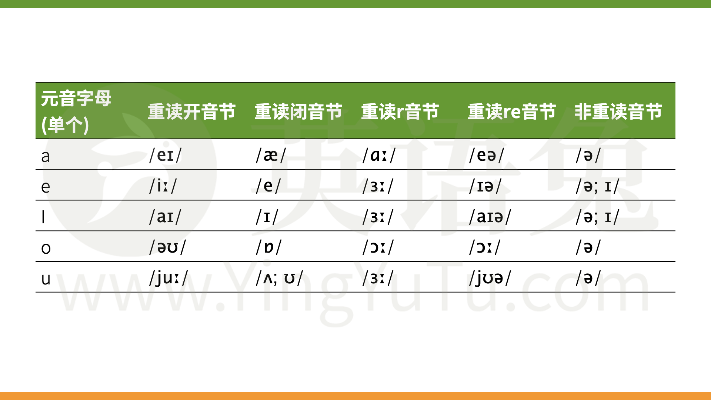
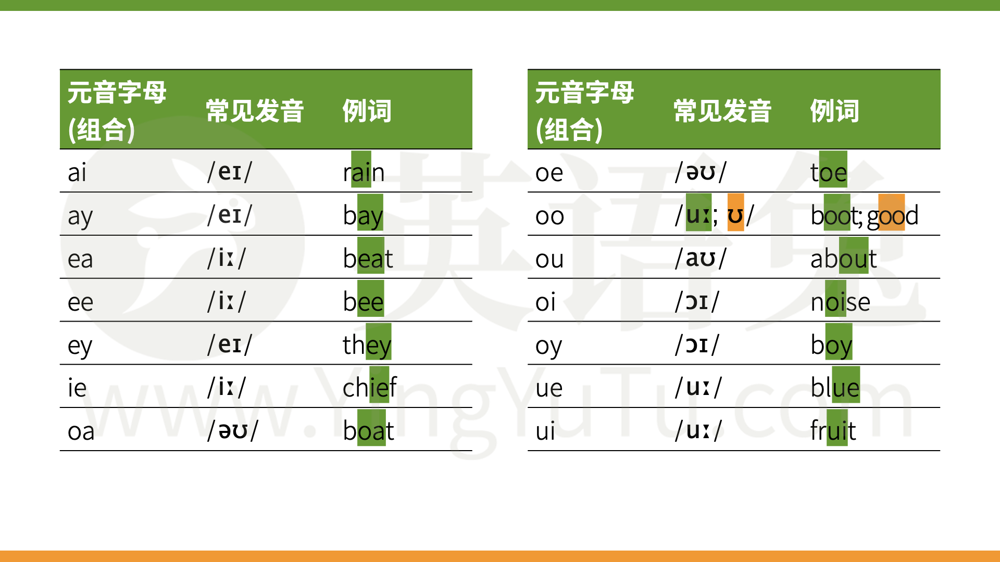
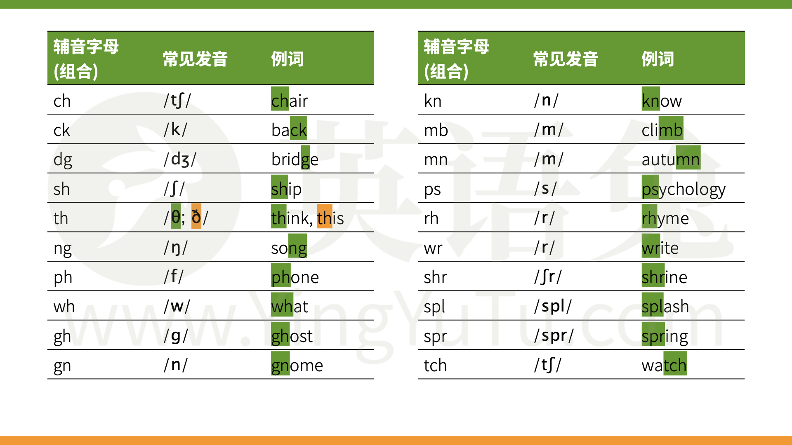

# 音标&自然拼读

## 音标

### J 组合

## 自然拼读

### 单个辅音字母

### 单个元字母

### 元音字母组合

### 辅音字母组合

## 音节

# Be动词（现在时）

##  一、人称搭配（肯定 + 否定）

| 人称     | 主语                        | 肯定形式 (缩写)                | 否定形式 (缩写)                 | 关键说明                 |
| ------ | ------------------------- | ------------------------ | ------------------------- | -------------------- |
| 第一人称单数 | I 我                       | **am (I'm)**             | **am not      (I'm not)** | 仅 I 用 am             |
| 第二人称   | You 你 / 你们                | **are (You're)**         | **are not (aren't)**      | 单复数都用 are            |
| 第三人称单数 | He/She/It 他 / 她 / 它       | **is (He's/She's/It's)** | **is not (isn't)**        | **三单，固定用 is**        |
| 复数人称   | We/They 我们 / 他们 / 她们 / 它们 | **are (We're/They're)**  | **are not (aren't)**      | **they 不属于三单，用 are** |

**一般疑问句 & 简短回答**

|问句|肯定回答（禁止缩写）|否定回答（可缩写）|
|---|---|---|
|Are you...?|Yes, **I am**|No, **I'm not**|
|Is he/she/it...?|Yes, **he/she/it is**|No, **he/she/it isn't**|
|Are we/they...?|Yes, **we/they are**|No, **we/they aren't**|

|陈述句（说事实）|疑问句（提问题）|回答|
|:--|:--|:--|
|`I am happy.` 我开心。|`Am I happy?` 我开心吗？|`Yes, you are. / No, you aren’t.`|
|`The cat is black.` 这只猫是黑色的。|`Is the cat black?` 这只猫是黑色的吗？|`Yes, it is. / No, it isn’t.`|
|`They are students.` 他们是学生。|`Are they students?` 他们是学生吗？|`Yes, they are. / No, they aren’t.`|

#### 1.询问职业的常用句型

- **句型 1：** `What's your job?` (你的工作是什么？)
    
- **句型 2：** `What do you do?` (你是做什么的？—— **这是最地道的问法**)
    
- **回答格式：** `I'm a/an + 职业名称`
    
    - **a 的用法：** 用于辅音音素开头的职业。例：`I'm a waiter.` (我是服务员)
        
    - **an 的用法：** 用于元音音素开头的职业。例：`I'm an engineer.` (我是工程师)
        

#### 2. 描述工作地点的句型

- **基本结构：** `主语 + work(s) + 介词 + 工作地点`
    
- **介词深度解析：**
    
    - **in：** 用于较大或封闭的场所。例：`My dad works in a factory.` (我爸爸在工厂工作)
        
    - **at：** 用于特定地点或较小场所。例：`I work at home.` (我在家工作)
        
    - **from：** 专门搭配 `work from home`。例：`She works from home.` (她在家远程办公)
- 