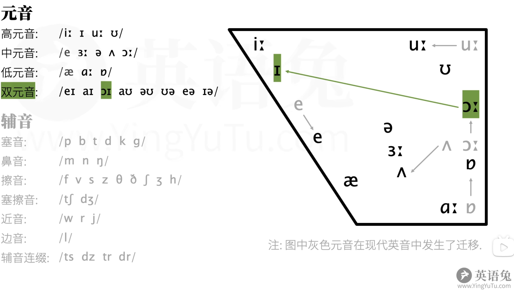
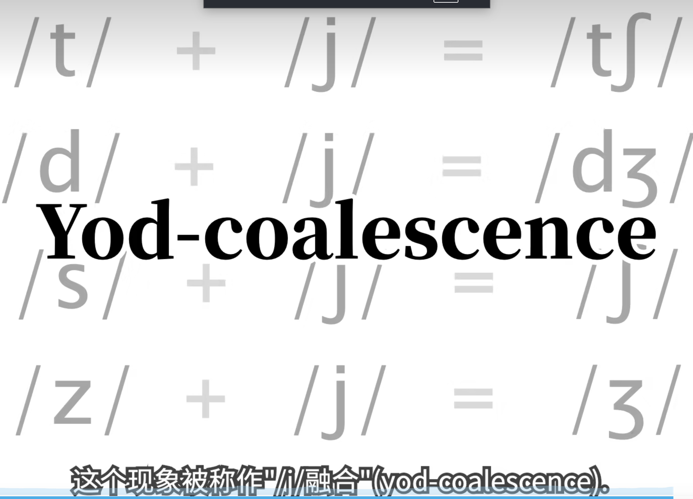

# 音标&自然拼读

## 音标

### J 组合

## 自然拼读

# be动词

|**人称类别**|**主语 (Subject)**|**be动词**|**缩写形式**|**例子**|
|---|---|---|---|---|
|**第一人称单数**|**I** (我)|**am**|**I'm**|I'm a student. (我是学生)|
|**第二人称**|**You** (你/你们)|**are**|**You're**|You're strong. (你很强壮)|
|**第三人称单数**|**He / She / It**|**is**|**He's / She's / It's**|It's a trend. (这是趋势)|
|**复数人称**|**We / They**|**are**|**We're / They're**|We're ready. (我们准备好了)|

#### 1. 询问职业的常用句型

- **句型 1：** `What's your job?` (你的工作是什么？)
    
- **句型 2：** `What do you do?` (你是做什么的？—— **这是最地道的问法**)
    
- **回答格式：** `I'm a/an + 职业名称`
    
    - **a 的用法：** 用于辅音音素开头的职业。例：`I'm a waiter.` (我是服务员)
        
    - **an 的用法：** 用于元音音素开头的职业。例：`I'm an engineer.` (我是工程师)
        

#### 2. 描述工作地点的句型

- **基本结构：** `主语 + work(s) + 介词 + 工作地点`
    
- **介词深度解析：**
    
    - **in：** 用于较大或封闭的场所。例：`My dad works in a factory.` (我爸爸在工厂工作)
        
    - **at：** 用于特定地点或较小场所。例：`I work at home.` (我在家工作)
        
    - **from：** 专门搭配 `work from home`。例：`She works from home.` (她在家远程办公)
- 